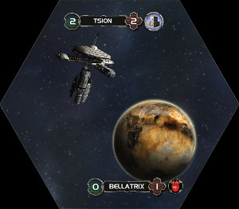
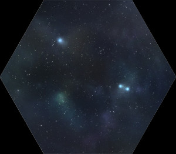
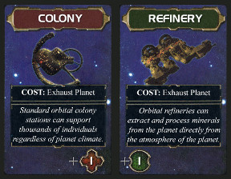
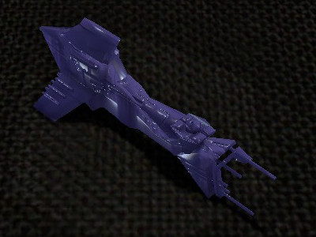
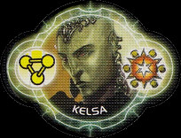
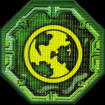
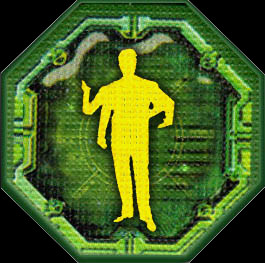
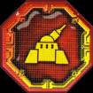

# Shattered Ascension Rewritten Rulebook  - v18_2017-??-??
***By Cyrusa***

> This rulebook is an attempt at rewriting the full Twilight Imperium 3 rules integrating the Shattered Ascension mod. The main goals were to be more concise and more precise (meaning less ambiguities in games).
> To do this, I had to make some minor changes to the SA ruleset here and there. I have indicated the changes I made in comments such as this one so they stand out.

### Notes
***Contradictions***  
If a wording would contradict with another (for example saying you can do something that another wording prevents), then either it explicitly refers to the other wording it is contradicting with, in which case it takes precedence, or it does not, in which case the default precedence order is:  
Action Cards > Political Cards > Racial Advancements > Racial Abilities > Technologies > Rules from this rulebook

***Compliance***  
A player subject to negative effects (for example discard *3* Trade Goods) must fulfil them as far as able (if she only has *2* Trade Goods, she must discard them).

## Overview
In a game of Twilight Imperium, 2 to 8 players take the role of varied great races fighting for supremacy in the galaxy after the ruling Lazax Empire has fallen. The game is played over several Rounds, during which players strive to [claim Objectives](#user-content-ClaimObjectives_StatusPhaseStep) in order to score Victory Points. The first player to reach a predetermined number of Victory Points is declared the winner and the new Empress of the Galaxy.

## Content
<!-- * [Components](#user-content-Components) -->

* [Setup](#user-content-Setup)
* [Round](#user-content-Round)
	* [Strategy Phase](#user-content-StrategyPhase)
	* [Action Phase](#user-content-ActionPhase)
	* [Status Phase](#user-content-StatusPhase)
* [Space Battle](#user-content-SpaceBattle)
* [Invasion Combat](#user-content-InvasionCombats)
* [Systems](#user-content-Systems)
	* [Generalities Regarding Systems](#user-content-GeneralitiesRegardingSystems)
	* [Home Systems](#user-content-HomeSystems)
	* [Special Systems](#user-content-SpecialSystems)
	* [Regular Systems](#user-content-RegularSystems)
	* [Planetary Systems](#user-content-PlanetarySystems)
	* [Void Systems](#user-content-VoidSystems)
* [Planets](#user-content-Planet)
	* [Generalities Regarding Planets](#user-content-GeneralitiesRegardingPlanets)
	* [Technology Specialties](#user-content-TechnologySpecialty)
	* [Refresh Abilities](#user-content-RefreshAbility)
	* [Facilities](#user-content-Facility)
	* ["Turning Neutral"](#user-content-PlanetTurnsNeutral)
	* [Trade Stations](#user-content-TradeStations)
* [Other Board Elements](#user-content-OtherBoardElements)
	* [Wormholes](#user-content-Wormholes) 
	* [Border Tokens](#user-content-BorderTokens)
		* [Asteroid Belts](#user-content-AsteroidBelts)
		* [Space Mines](#user-content-SpaceMines)
	* [Artifacts](#user-content-Artifact)
	* [Worldgates](#user-content-Worldgate)
	* [Domain Counters](#user-content-DomainCounters)
* [Spending Resources And Influence](#user-content-SpendingResourcesAndInfluence)
* [Command Counters](#user-content-CommandCounters)
	* [Command Pool](#user-content-CommandPool)
	* [Fleet Supply](#user-content-FleetSupply)
	* [Strategy Allocation](#user-content-StrategyAllocation)
* [Action Cards](#user-content-ActionCards)
* [Twilight Council and Political Cards](#user-content-TwilightCouncilAndPoliticalCards)
* [Technologies](#user-content-Technologies)
* [Racial Advancements](#user-content-RacialAdvancements)
* [Trade Goods](#user-content-TradeGoods)
* [Trade Contracts and Trade Agreements](#user-content-TradeContractsAndTradeAgreements)
* [Components Limitations](#user-content-ComponentsLimitations)
* [Units](#user-content-Units)
	* [Unit Characteristics](#user-content-UnitCharacteristics)
	* [Unit Categories](#user-content-UnitCategories)
	* [Unit List](#user-content-UnitList)
	* [Unit Abilities](#user-content-UnitAbilities)
* [Leaders](#user-content-Leaders)
	* [General Leader Rules](#user-content-GeneralLeaderRules)
	* [Leader Abilities](#user-content-LeaderAbilities)
		* [Admiral](#user-content-Admiral)
		* [Diplomat](#user-content-Diplomat)
		* [General](#user-content-General)
		* [Agent](#user-content-Agent)
		* [Scientist](#user-content-Scientist)
* [Elimination And Surrender](#user-content-EliminationAndSurrender)
* [Miscellaneous Rules](#user-content-MiscellaneousRules)
* [Definitions](#user-content-Definitions)
* [Rule Adjustments Based On The Number Of Players](#user-content-RuleAdjustmentsBasedOnTheNumberOfPlayers)
* [Annex 1: Domain Counters Effects](#user-content-DomainCountersEffects)
* [Annex 2: Variants and Optional Rules](#user-content-VariantsAndOptionalRules)

<!-- TODO: FINISH THIS SECTION AND PUT IMAGES
## Components 
### Galaxy
##### Artifacts
[image]

[Artifacts](#user-content-Artifact) are littered throughout the galaxy and offer rewards to those who control them.

##### Asteroid Belts
[image]

[Asteroid Belts](#user-content-AsteroidBelts) are placed between Systems and restrict movement between them.

##### Domain Counters
[image]

[Domain Counters](#user-content-DomainCounters) are placed on planets or in space and offer rewards or punishment.

##### Mecatol Rex Custodians
[image]

[Custodians](#user-content-Custodians) guard the major planet of Mecatol Rex.

##### Planet Cards
[image]

[Planet Cards](#user-content-PlanetCards) are owned by the controller of the corresponding planets, and mark in which state they are: exhausted or refreshed.

##### Space Mines
[image]

[Space Mines](#user-content-SpaceMines) can be placed between Systems to deal damage to Ships passing through them.

##### Systems 
[image]

The [Systems](#user-content-Systems) are the hexagonal tiles the galaxy is made of.

##### Wormhole Tokens
[image]

[Wormhole Tokens](#user-content-Wormholes) are sometimes used to add additional Wormholes on galaxies.

### Units
##### Units
[image]

[Units](#user-content-Units) represents the military personel, shipyards, defence systems and spaceships that players will command. Units that are not on the galaxy are kept in the player's **Reinforcement Areas**.

##### Shock Troops Tokens
[image]

These tokens represent [Shock Troops](#user-content-ShockTroop), a specific type of units.

##### Supplement Ground Force and Fighter Tokens
[image]

These tokens can be substituted for [Ground Forces](#user-content-GroundForce) and [Fighter](#user-content-Fighter) if there are not enough miniatures.

### General

##### Action Cards
[image]

[Action Card](#user-content-ActionCards) 

##### Bonus Counters
[image]
##### Facilities
[image]
##### Hit Counters 
[image]
##### Objective Cards
[image]
##### Political Cards
[image]
##### Speaker Token And Rotation Cycler
[image]
##### Strategy Cards
[image]
##### Technology Tree
[image]
##### Trade Goods
[image]
##### Victory Point Track
[image]

### Race-Specific
##### Command Counters
[image]
##### Flags
[image]
##### Flagship Cards
[image]
##### Race Sheets
[image]
##### Racial Advancements
[image]
##### Trade Contracts
[image]
 -->

## Setup 
*Note: players may sit now, but will likely have to change seat at some point.*

**Setup Sequence**

1. [Building the Galaxy](#user-content-Setup_BuildingTheGalaxy)  
2. [Table Setup](#user-content-Setup_TableSetup)  
3. [Victory Point Goal](#user-content-Setup_VictoryPointGoal)  
4. [Game Options](#user-content-Setup_GameOptions)  
5. [Secret Objectives](#user-content-Setup_SecretObjectives)  
6. [Race Picking](#user-content-Setup_RacePicking)  
7. [Home System Location Bidding OR Galaxy Building](#user-content-Setup_HSLocationBiddingORGalaxyBuilding)  
8. [Speaker Token Bidding](#user-content-Setup_SpeakerTokenBidding)  
9. [Starting Trade Goods Normalisation](#user-content-Setup_StartingTradeGoodsNormalisation)  
10. [Orienting the Rotation Cycler](#user-content-Setup_OrientingTheRotationCycler)  
11. [Revealing Objectives](#user-content-Setup_RevealingObjectives)  
12. [Finalising Setup](#user-content-Setup_FinalisingSetup)  

### 1) Building the Galaxy 
> I put this step at the beginning of the setup so it can be done in advance by the host.

Choose either:
 
* Choose and build a pre-set map from [Shattered Ascension Map Database](http://www.astralvault.net/games/SA/maps.html)
* Decide to have the player build the map following the [Star by Star procedure](#user-content-StarByStar). In this case, the map will be built at step 6.

### 2) Table Setup 

> Again, this step is at the top, because it does not require any choice and can be done in advance.

Find an area of the table that is convenient for all players to reach. Designate this 
space the *common play area*, and populate it with the following:

* Shuffled Action Cards deck
* Shuffled Political Cards deck
* Ground Force and Fighter tokens
* Trade Goods tokens
* Planet Cards deck
* The Strategy Cards from number 1 to 8. Add in the 9th if there are 4, 7 or 8 players.
* Shuffled deck of Stage I Public Objectives
* Shuffle deck of Stage II Public Objectives
* Shuffled deck of Preliminary Objectives
* Shuffled deck of Secret Objectives
* The Special Objective Cards
* The Victory Point track
* The [Technology Tree](#http://www.astralvault.net/games/SA/TTS/Misc/CascadingTechTreeDark_SA.jpg)

Inside this common play area, designate a space that will be used as the *Twilight Council*.  

### 3) Victory Point Goal 

Decide on the number of Victory Points required to win. The recommended values are:

* 8 Victory Points for 2-player games
* 10 Victory Points for normal games
* 12 Victory Points for a normal game with one more round. Some prefer it because it provides a real late-game stage.
* 14 Victory Points for epic (long) games

### 4) Game Options 
Decide on the game options to include:

* [Path of Fate](#user-content-PathOfFate) (Race-Specific Objectives)
* [Simultaneous Action System](#user-content-SimultaneousActionSystem)
* [Ascendancy](#user-content-Ascendancy) (essentially doubles the Victory Point goal and makes objectives claimable multiple times)

### 5) Secret Objectives 

If this game is not a 2-player game, deal two Secret Objective cards to each player. They will have to discard one of them later.

### 6) Race Picking 
> The race picking and Home System bidding now use the order given by the die roll, instead of starting with the highest roller and going clockwise.

1. Have each player roll a die. Remember the results, as they will be used in the following setup steps as well.
2.  Starting with the highest rolling player and in **decreasing rolling order**, each player may either choose any available race to play or pass. The unchosen races form the pool of random races.
3.  All players without a race are **secretly** dealt a random race from the pool. They may either keep them, or reshuffle them into the pool (without revealing them).
4.  Conduct the above step a second time.
5.  All player without a race are **publicly** dealt a random race from the pool, that they must play for this game.

### 7) Home System Location Bidding OR Galaxy Building 

*Note: The Trade Goods that are bid at this step are taken from the reserve, not from the players.*

#### Pre-Set Map

If you chose a **pre-set map**, then players will now bid on the Home System location they wish to start on.  

The highest rolling player places a flag (or another item if her race is not public) along with a bid of Trade Goods (0 is allowed) on any Home System Location.
Then in **decreasing rolling order** (looping), each player not currently holding a bid on a Home System either places a bid on a new Home System or overbid another player. This continues until all players hold a bid on a Home System location.  

All players then receive as many Trade Goods as the difference between the highest bid and their own bid.

#### Star by Star Map

If you chose to build the map using the [Star by Star procedure](#user-content-StarByStar), now is the time to do it.

***Players may now change seat in order to be aligned with their Home System location.***

### 8) Speaker Token Bidding 

*Note: The Trade Goods that are bid at this step are taken from the reserve, not from the players.*

The lowest rolling player places a bid of Trade Goods (0 is allowed) on the Speaker Token. Then in **increasing rolling order** (looping), each player may either withdraw from the bidding or overbid. The winner gains the Speaker Token. The other players receive as many Trade Goods as the winning bid.

### 9) Starting Trade Goods Normalization 

All players now gain or lose the same number of Trade Goods such that the player with the lowest amount has exactly 1 Trade Good.

### 10) Orienting the Rotation Cycler 
> I created a dedicated step for this, placed after the Trade Good Normalization step, so transactions between players do not affect the normalization

The player holding the Speaker Token may now set the orientation of the Rotation Cycler as she wishes.

### 11) Revealing Objectives 
Reveal:

* All Special Objectives (if playing a 2-player game, exclude Sovereign and Magisterial)
* 3 random Stage I Public Objectives
* 1 random Preliminary Objective (not if playing a 2-player game)
* 3 random Stage II Public Objectives

### 12) Finalising Setup 

* Each player discards a Secret Objective and shuffles it back into the deck.
* Each player draws 2 Political Cards
* Reveal hidden races
* Each player chooses a set of plastic miniatures and takes her race's Command Counters. She places them near her race sheet to form her "reinforcements".
* Each player takes the other assets of her race:
	* Flags
	* Flagship card
	* Trade Contracts
	* Racial Advancements
	* Leaders
	* Planet Cards of her race's Home System planets
* Each player places a Flag on the zero of the Victory Point Track.
* Each player places Flags on the technology tree besides her starting technologies (indicated on her race sheet).
* Each player places her starting units and Leaders (indicated on her race sheet) in her Home System. [Troops](#user-content-Troop) and [Installations](#user-content-Installation) may be placed on any planet in it. Leaders may be placed on any ship or planet in it.
* Each player places Command Counters from her reinforcements onto her race sheet as follows:
	* 2 in Strategy Allocation (with the race's symbol side up)
	* 3 in Command Pool (with the race's symbol side up)
	* 3 in Fleet Supply (with the ship silhouette side up)

### 13) Play!

Start the first Round.

## Round 

Shattered Ascension is played over a consecutive number of Rounds. Each Round is split into three phases: The [Strategy Phase](#user-content-StrategyPhase) where players place a Political Card in the Twilight Council as their agenda and pick their Strategy Card for the Round, the [Action Phase](#user-content-ActionPhase), where players use their Strategy Cards, move their ships, conquer planets and build units, and the [Status Phase](#user-content-StatusPhase), where the board is cleaned up and players can gain Victory Points by claiming Objectives. If no player is declared winner at the end of a Round, another Round starts.

### Strategy Phase 
**Strategy Phase sequence:**  

1. [Twilight Council Propositions](#user-content-TwilightCouncilPropositions)
2. [Strategy Card Picking](#user-content-StrategyCardPicking)

#### 1) Twilight Council Propositions 

Each player must place face down a Political Card from her hand in the Twilight Council, and mark it with one of her flags. Political Cards placed in the Twilight Council zone in this manner are called **Agendas**. If the Assembly Strategy Card is played this round, the Agendas to be voted on will be chosen among these cards.  
After all players have placed their Agenda, they are revealed and the game goes on.  

**Additional rules:**

* At any time during this step, players may discard two Political Cards from their hand to draw another Political Card. They may do so as many times as they want.
* Instead of placing a card from their hand, players may place the first card of the Political Cards deck, without looking at it.

#### 2) Strategy Card Picking 

Starting with the Speaker and proceeding in the order defined by the Rotation Cycler, each player must pick one of the available Strategy Cards (that was not already picked by another player). they will be able to use them during the upcoming Action Phase.

After that, place a Bonus Counter on each of the unpicked Strategy Cards. These Bonus Counters stack from one Round to the next, and increase the value of the Strategy Cards they are on: when a player picks a Strategy Card, she converts each Bonus Counter on it into either a Command Counter or a Trade Goods that she adds to her race sheet.

### Action Phase 
**Content:**
* [Strategic Action](#user-content-StrategicAction)
* [Passing](#user-content-Passing)
* [Tactical Action](#user-content-TacticalAction)  
	1. [System Activation](#user-content-SystemActivation_TacticalActionStep)
	2. [Ships Movement](#user-content-ShipsMovement_TacticalActionStep)
	3. [Space Cannon Fire](#user-content-SpaceCannonFire_TacticalActionStep)
	4. [Space Battle](#user-content-SpaceBattle_TacticalActionStep)
	5. [Planetary Landings](#user-content-PlanetaryLandings_TacticalActionStep)
	6. [Planetary Landings Resolution](#user-content-PlanetaryLandingsResolution_TacticalActionStep)
	7. [Production](#user-content-Production_TacticalActionStep)

During the Action Phase, each player will take an **Action**, that can be either a [Strategic Action](#user-content-StrategicAction), a [Tactical Action](#user-content-TacticalAction), or [Passing](#user-content-Passing). The order in which players can take their Action is given by their [initiative](#user-content-Initiative), the player with the lowest initiative being the first to take an Action.  
This sequence (each player taking an Action) is repeated until all players have Passed, at which point the Action Phase ends and the Status Phase begins.

**Initiative**   
The **initiative** of a player is the number printed on her Strategy Card.

**Active Player**  
A player currently taking an Action is called the **active player**.

**"as an action"**  
Some effects in the game are used "as an action". This means that using such effects is done instead of taking an Action during the Action Phase.

#### Strategic Action 

A Strategic Action corresponds to playing a Strategy Card. When a player performs a Strategic Action, she uses the **Primary Ability** of her Strategy Card, then other players, following the order defined by the Rotation Cycler (starting with either the left or right neighbour of the active player, depending on the orientation of the Rotation Cycler), may choose to use the **Secondary Ability** of the card.  
After that the used Strategy Card is flipped on its *inactive* side, and may not be used again this Round. 

**Important: When performing a Strategic Action, the active player ***may not*** execute the Secondary Ability of the Strategy Card she is playing.**

#### Passing 

A player performs this action when she does not want to perform any other action for the rest of this Action Phase. When it would be the turn of a player that passed, simply skip her. If all players have passed, the Action Phase ends and the [Status Phase](#user-content-StatusPhase) starts.  

**Important: A player may not pass before having used her Strategy Card through a Strategic Action.**  
*Note: A player that passed may still use the Secondary Abilities of Strategy Cards played after she passed.*

#### Tactical Action 

All the ship movements, planetary conquests, unit productions and much more will happen during Tactical Actions.  
After declaring a Tactical Action, a player must follow the steps of the [Activation Sequence](#user-content-ActivationSequence) described below. With the exception of the first one, each of these steps is only resolved if necessary.  
In this section "you" refers to the active player.

**The Activation Sequence:**   
1. [System Activation](#user-content-SystemActivation_TacticalActionStep)
2. [Ships movement](#user-content-ShipsMovement_TacticalActionStep)
3. [Space Cannons Fire](#user-content-SpaceCannonFire_TacticalActionStep)
4. [Space Battle](#user-content-SpaceBattle_TacticalActionStep)
5. [Planetary Landings](#user-content-PlanetaryLandings_TacticalActionStep)
6. [Planetary Landings Resolution](#user-content-PlanetaryLandingsResolution_TacticalActionStep)
7. [Production](#user-content-Production_TacticalActionStep)

**Activated System**  
A System is considered **activated by a player** when it contains a Command Counter from that player, preventing her units in it from acting again until the Command Counter is removed. However, most effects simply refer to **activated** and **unactivated** Systems without specifying any player, in which case the player is the one using the effect.

**Allegiances**   
From the perspective of a given player:

* **Friendly** units and planets are those she controls.
* **Enemy** units and planets are those that are controlled by other players.
* **Neutral** units and planets are those that are not controlled by any player.

Most effects using these terms do not specify which player they use the perspective of. In these cases, the player is the one using the effect.

##### 1) System Activation 

**Activate** a system by placing a [Command Counter](#user-content-CommandCounters) from the [Command Pool](#user-content-CommandPool) area of your Race Sheet in it.  
You may not activate a system that already contains one of your Command Counters, but you can activate a system that contains Command Counters of *other players*.  
In fact, as a general rule, you can ignore Command Counters belonging to other players on the galaxy.

##### 2) Ships movement 

<!-- In this step, you may move friendly ships **into**, and this is important, only **into the System just activated**. This means that all the ships you are moving must **end their movement in the System just activated** (except if something happens to them on their way, that would stop their movement, like a failed Gravity Rift roll).
 -->
During this step, you may move some of your ships from unactivated Systems to the System that was just activated.

The ships movement step consists in two parts:

* A) [Plotting trajectories](#user-content-PlottingTrajectories)
* B) [Executing movements](#user-content-ExecutingMovements)

###### A) Plotting Trajectories 

You may not move ships present in activated Systems, unless they are in the System just activated.
For each ship you want to move, you have to plot a legal trajectory for it. A legal trajectory is a chain of [adjacent](#user-content-AdjoiningAdjacent) Systems starting with the System containing the ship and ending with the System just activated. It must also satisfy the following conditions:

* No System of the trajectory (except the System just activated) may contain [enemy](#user-content-Allegiances) ships. (e.g. ships may not move through Systems containing enemy ships)
* The ship must have a sufficient [movement value](#user-content-MovementValue) to follow the trajectory. By default, moving from a System to an adjacent System costs 1 movement. For example, a ship with a *movement value* of 1 can only move in adjacent Systems.

***Notes:***

* *A ship does not need to take the shortest trajectory towards its final destination.*
* *Trajectories that start and end in the just activated System without leaving it are allowed, and constitute a movement.*

<!-- For each friendly ship she wants to move, the active player has to plot a legal trajectory for it. A legal trajectory for a ship is a chain of [adjacent](#user-content-AdjoiningAdjacent) systems starting from the System containing the ship and ending in the System just activated, that satisfies the following conditions:

* The starting System was **not activated** by the active player, or is the System that was just previously activated. (e.g. ships may not move out of an activated System, unless it is the System that has been activated during the step 1 of the same Tactical Action)
* No System of the trajectory (except the System just activated) contains enemy ships. (e.g. ships may not move through Systems containing enemy ships)
> SA: Unlike in TI3, enemy Fighters do block movement in SA.

* The ship must have a sufficient *movement value* to follow the trajectory. By default, moving from a System to an adjacent System costs 1 movement. For example, a ship with a *movement value* of 1 can not move further away than 1 system.

*Notes:*

* A ship does not need to take the shortest trajectory towards its final destination
* Trajectories that start and end in the just activated System without leaving it are allowed, and will result in a movement. -->

###### B) Executing movements 

One by one and in the order of your choice, move each ship according to their trajectory.

##### 3) Space Cannons Fire 

> Change from base SA: This step is now called "Space Cannons Fire" instead of "PDS Fire", because any unit with the Space Cannon ability can shoot during this step, not only PDSs (some Flagships for example).
> Change from base SA: Precise order in which players decide whether to shoot: Non-active players with the Speaker being first, then following the Rotation Cycler, and finally the active player

During this step, units with the [Space Cannon (*n*)](#user-content-SpaceCannon_unitAbility) ability that are in the System just activated may fire at a fleet in the System just activated. There are two possibilities:

* If the unit **does not belong to the active player**, it can only fire at a fleet **belonging to the active player** in the just activated System.
* If the unit **belongs to the active player**, it can fire at **any** fleet in the just activated System (except the active player's own fleet).

Starting with the Speaker and following the Rotation Cycler, the non-active players may in turn shoot with some or all of their units with Space Cannon. Then it is the turn of the active player.

When a unit with Space Cannon (*n*) fires, it performs *n* [combat rolls](#user-content-CombatRoll). Hits must be assigned to ships of the targeted fleet by the fleet's owner. 

##### 4) Space Battle 

At this step, if there are ships controlled by two different players in the System just activated, a Space Battle must be resolved.  
In this Space Battle, the active player is the *attacker*, while the other player is the *defender*. For complete rules about how to resolve a Space Battle, see the [Space Battle section](#user-content-SpaceBattle).

##### 5) Planetary Landings 

> Change from base SA: Clarification that each ship bombarding must be assigned to a single planet and may not split its bombardment between multiple planets. Clarification that the ships bombarding must be assigned during this step of the activation sequence.

The Planetary Landings step consists in two parts: 

###### A) Planetary landings

The active player may land [Troops](#user-content-Troop), [PDSs](#user-content-PDS) and [Leaders](#user-content-Leaders) currently carried by her ships in the System just activated on planets in the same System. PDSs and Leaders landing on non-friendly planets must be accompanied by at least one Troop.

###### B) Bombardment assignment

The active player may assign some of her ships in the System just activated with the [Bombardment](#user-content-Bombardment_unitAbility) ability to the [non-friendly](#user-content-Allegiances) planets of this System, in order to be able to bombard them during the [6) Planetary Landing Resolution](#user-content-PlanetaryLandingsResolution_TacticalActionStep) step of this Tactical Action. 

<!-- The Planetary Landings step consists in two parts: 

* **Planetary landings**: The active player may land Troops, PDSs and Leaders currently carried by his ships in the just activated System on planets in the same System. PDSs and Leaders landing on non-friendly planets must be accompanied by at least one troop.
* **Bombardment assignment**: The active player may assign some of his ships in the just activated System with the *Bombardment* ability to the non-friendly planets of this System, in order to be able to bombard them during the 6) Planetary Landing resolution step.  -->

##### 6) Planetary Landings Resolution 

> Change from base SA: This step is now called "Planetary Landings Resolution" instead of "Invasion Combat", since not all planetary landings trigger an Invasion Combat.

Until all planets that had units or Leaders landed on them or ships assigned to bombard them in the System just activated have been *resolved*, the active player chooses an unresolved planet and resolves it according to the following:  

***Note:*** *In what follows, "landed" Troops, PDSs and Leaders refer to the Troops, PDSs and Leaders that were landed on the planet being resolved.*

<!-- ###### If the planet is *friendly*

No bombardment occur.

###### If the planet is *neutral*

The active player must resolve the [Domain Counters](#user-content-DomainCounters) present on the planet (if there is any). No bombardment occur (unless a Domain Counter triggers an Invasion Combat). If there are still landed Troops after resolving the Domain Counters, the active player takes control of the planet, [exhausted](#user-content-RefreshedAndExhaustedStates), else, the defender destroys all landed PDSs and makes a [Fate Roll](#user-content-FateRoll) for each landed Leader.

###### If the planet is *enemy* and *contains* at least one enemy Troop or PDS

If you landed at least one troop, resolve an [Invasion Combat](#user-content-InvasionCombats) on this planet, else the ships assigned to this planet [bombard](#user-content-Bombardment_unitAbility) it without an Invasion Combat taking place.

###### If the planet is *enemy* and *does not contain* any enemy Troop or PDS

The ships assigned to this planet [bombard](#user-content-Bombardment_unitAbility) it. Then the active player takes control of it, exhausted.  
 -->

**Planetary Landing Resolution:**

* *If the planet is **friendly**:*    
No bombardment occur.
* *If the planet is **neutral**:*  
The active player must resolve the [Domain Counters](#user-content-DomainCounters) present on the planet (if there is any). No bombardment occur (unless a Domain Counter triggers an Invasion Combat). If there are still landed Troops after resolving the Domain Counters, the active player takes control of the planet, [exhausted](#user-content-RefreshedAndExhaustedStates), else, the defender destroys all landed PDSs and makes a [Fate Roll](#user-content-FateRoll) for each landed Leader.
* *If the planet is **enemy** and **contains** at least one enemy troop or PDS:*  
If you landed at least one troop, resolve an [Invasion Combat](#user-content-InvasionCombats) on this planet, else the ships assigned to this planet [bombard](#user-content-Bombardment_unitAbility) it without an Invasion Combat taking place.
* *If the planet is **enemy** and **does not contain** any enemy troop or PDS:*  
The ships assigned to this planet [bombard](#user-content-Bombardment_unitAbility) it. Then the active player takes control of it, exhausted.  

##### 7) Production 

***Note:*** *All the resources that the active player decides to spend during this step are added up and spent at once at the end of the step. The total amount of resources that must be spent is rounded up.* 

The Production step consists in three parts, that must be resolved in the following order: 

###### A) Deploy Space Mines

See the [Deploy Space Mines](#user-content-DeploySpaceMines_unitAbility) ability.

###### B) Produce units  

The active player may produce units at each of her units with the [Produce Units (*n*)](#user-content-ProduceUnits_unitAbility) ability in the Systems just activated, with a **production capacity** of *n*. In most cases, units will be produced by [Space Docks](#user-content-SpaceDock).  

**Producing units**  
When producing units, any combination of units may be produced provided the following three limitations are respected and they can be placed in the System (see [placing produced units](#user-content-PlacingProducedUnits)):
  
* **Production Capacity:** Each unit has a production capacity cost, the total production capacity cost of the produced units may not exceed the production capacity of the unit producing them.
* **Resource Cost:** Each unit has a resource cost. The player producing units must spend the required amount of resources.  
* **Blockade:**   
No ships may be produced in a System already containing enemy ships.

<!-- * **Fleet Supply**: Be careful that if you violate your [Fleet Supply](#user-content-FleetSupply) in the System, you will have to scuttle some ships.
* **Fighter Capacity**: The System must have a sufficient [Fighter Capacity](#user-content-Capacity_unitAbility) to support the produced Fighters. -->

**Placing produced units**   
> Change from base SA: Made explicit where troops and PDSs produced by units in space may be placed.  

After units have been produced, they must be placed according to the following rules. The *producer* refers to the unit that produced them:  

* Ships are placed in the space of the System containing the *producer*
* If the *producer* is on a planet, then all produced units with the *Planet-based* trait (Troops and PDSs) must be placed on the planet. Else, they may be distributed in the System among friendly planets and friendly units with sufficient [capacity](#user-content-Capacity_unitAbility) to carry them.

###### C) Build Space Docks

The active player may build Space Docks on some of the planets in the System just activated. A Space Dock may only be built on a planet that she has controlled since the beginning of the Round, and that does not already contain a Space Dock. Newly built Space Docks are placed **exhausted** (flipped) and may thus not produce units until they are refreshed (usually during the Status Phase). 

<!-- * **Deploy Space Mines**:  
See the [Deploy Space Mines](#user-content-DeploySpaceMines_unitAbility) ability.
* **Produce units**:  
The active player may produce units at each of her units with the [Produce Units (*n*)](#user-content-ProduceUnits_unitAbility) ability in the Systems just activated, with a **production capacity** of *n*. In most cases, units will be produced by [Space Docks](#user-content-SpaceDock).  
* **Build Space Docks**:  
The active player may build Space Docks on some of the planets in the System just activated. A Space Dock may only be built on a planet that she has controlled since the beginning of the Round, and that does not already contain a Space Dock. Newly built Space Docks are placed **exhausted** (flipped) and may thus not produce units until they are refreshed (usually during the Status Phase).  --> 

### Status Phase 
> Change from base SA: Removed the "Pay upkeep for Fleet Supply > 8" step. In my opinion, it does not have enough effects in normal games to justify its word count and learning time. It could become part of a set of optional rules related to epic games with huge maps and high Victory Point goal. 

> Change from base SA: Added a "Take back Agendas" step, where players have to take back their Agendas (the Political Cards they put in the Twilight Council zone during the Strategy Phase), if these agendas have not been voted on or discarded. Else, people would frequently just leave their Agenda in place face-up because they do not care, giving away precious informations to the opponents.   

> Change from base SA: Added a dedicated "Scuttle units and break Trade Agreements" step near the end of the sequence. The scuttle unit part is there so that this option visually appear in the Status Phase sequence.
As for the Trade Agreement part, the reasoning is as follows: Trade Agreements could be broken at any time during the Status Phase. But it was annoying and a bit immersion breaking to see people breaking low value Trade Agreements to get 1 Trade Good and buy a racial advancement. That's why it had its dedicated Status Phase step, located after the Racial Advancements unlocks.

After the Strategy Phase and the Action Phase comes the Status Phase. During this phase, players claim objectives granting them Victory Points, unlock Racial Advancements, and more generally "clean up the table" and prepare the game for the next Round.

**Status Phase sequence:**

1. [Claim Objectives](#user-content-ClaimObjectives_StatusPhaseStep)
2. [Progression Feedback](#user-content-ProgressionFeedback_StatusPhaseStep)
3. [Produce Trade Goods (2:1)](#user-content-ProduceTradeGoods_StatusPhaseStep)
4. [Unlock Racial Advancements](#user-content-UnlockRacialAdvancements_StatusPhaseStep)
5. [Refresh Planets](#user-content-RefreshPlanets_StatusPhaseStep)
6. [Receive 1 Action Card, 1 Political Card and 2 Command Counters](#user-content-ReceiveCardsAndCCs_StatusPhaseStep)
7. [Take back Agendas](#user-content-TakeBackAgendas)
8. [Reallocate Command Counters](#user-content-ReallocateCommandCounters_StatusPhaseStep)
9. [Scuttle units and break Trade Agreements](#user-content-Scuttling_StatusPhaseStep)
10. [Remove Command Counters from the board, return Strategy Cards, repair units, refresh Space Docks](#user-content-CleanUp_StatusPhaseStep)

#### 1) Claim Objectives 

Starting with the Speaker and following the Rotation Cycler, players may claim objectives to gain Victory points, eventually allowing them to win the game.

**Claiming an Objective**  
In order to claim an objective, a player must satisfy the requirements written on it, and not have already claimed it in the past (whether other players have already claimed it or not does not matter). The player then places one of her flags on the objective, and advances her flag on the Victory Point Track by the number of Victory Points indicated on the objective.

**Claiming Limit**  
During a Claim Objectives step, a player:  

* May claim:
	* At most 1 revealed Public Objective, either from Stage I or [Stage II](#user-content-StageIIPublicObjectives)
	* At most 1 [Secret Objective](#user-content-SecretObjectives) from her hand
	* The [Preliminary Objective](#user-content-PreliminaryObjectives) (if it is still claimable)
* Must claim:
	* All [Special Objectives](#user-content-SpecialObjectives) she qualifies for

##### Types of objectives

**Stage I Public Objectives (Yellow)**  
The standard type of objective.

**Stage II Public Objectives (Blue)**   
Stage II Public Ob
jectives are harder Objectives that grant more Victory Points than Stage I ones. However, a player may only claim a Stage II Public Objective if the number of revealed Stage I Public Objectives is equal to or higher than the number of Victory Point required to win the game.

**Preliminary Objectives (Grey)**   
At the end of a Round in which a Preliminary Objective has been claimed by at least one player, it becomes unclaimable by all other players for the rest of the game.

**Secret Objectives (Red)**   
When claiming a Secret Objective, a player must reveal it and show she indeed meets its requirements. If she does not meet them, the Secret Objective is discarded. If she does, it is placed with the other objective cards as a reminder.

**Special Objectives (Green)**  
There are three kinds of Special Objectives:
  
* *The Artifact Objectives* award Victory Points to the players controlling some of the four [Artifacts](#user-content-Artifact).
* *Sovereign and Imperial* award Victory Points to the players controlling respectively more than 8 and 12 planets outside their [Home Systems](#user-content-HomeSystems).
* *Voice of the Council* awards a Victory Point to the player that was elected [Voice of the Council](#user-content-VoiceOfTheCouncil) during the [Twilight Council](#user-content-TwilightCouncilAndPoliticalCards).

Special Objectives differ from the other kinds of objective in that if a player that has claimed one of them stop meeting its requirements, her claim on the Special Objective is lost **instantly**: she must remove her flag from the objective card and loses the associated Victory Points **immediately**. This does not prevent her from claiming this objective again later in the game. 

##### Winning the game

After all players have finished claiming objectives, if at least one of them has the required amount of Victory Point (or more) that was decided at the start of the game, the game ends.  
Whoever has the most Victory Points at that time is declared winner. If two or more players have the same number of Victory Points, ties are broken in favour of the one controlling the most planets outside of her Home System. If there is still a tie, tied players share the victory.

***"She has gained the power needed to claim the for too long empty Imperial Throne of Mecatol Rex. The Winnaran Custodians will step aside for their new Empress, whose destiny is to lead the galaxy to a new age of prosperity, peace and enlightenment."***

***Note:*** *It is possible for a player to win the game outside of the Status Phase (some effects grant Victory Points during the Action Phase). If a player reaches the required amount of Victory Points at any time outside of the Status Phase, the game ends immediately and a victor is determined following the same procedure as above.*

#### 2) Progression Feedback to Victory Point Leader 

The player with the most Victory Points gains as many [Trade Goods](#user-content-TradeGoods) as her lead in Victory Points lead over the player with the second-most Victory Points.

#### 3) Produce Trade Goods (2:1) 

Starting with the Speaker and following the Rotation Cycler, each player may spend resources to receive one Trade Good for each two resources spent.

#### 4) Unlock Racial Advancements 

Starting with the Speaker and following the Rotation Cycler, each player may now unlock some of her [Racial Advancements](#user-content-RacialAdvancements) by spending resources.

The cost of unlocking a Racial Advancements is computed as follows:  

* Base cost (printed on the card)
* **\-** Victory Points (owned by the player)
* **\+**
 Base costs of the other Racial Advancements the player has already unlocked

Multiple Racial Advancements can be unlocked at the same time, but they must be unlocked one after the other.

#### 5) Refresh Planets   

Starting with the Speaker, and following the Rotation Cycler, each player [refreshes her planets](#user-content-RefreshedAndExhaustedStates), by turning the corresponding planet cards upright.  

At this step, players may choose *not* to refresh some of their planets to instead do one of the following:

* Build a [Facility](#user-content-Facility) on the planet, provided it does not already contain one.
* Use the [refresh ability](#user-content-RefreshAbility) of the planet, if it has one.

#### 6) Receive 1 Action Card, 1 Political Card and 2 Command Counters 

Starting with the Speaker and following the Rotation Cycler, each player draws one [Action Card](#user-content-ActionCards), one [Political Card](#user-content-TwilightCouncilAndPoliticalCards), and receives two [Command Counters](#user-content-CommandCounters).

#### 7) Take back Agendas   

Players take back into their hand the Political Cards they placed as agendas in the Twilight Council during the previous Strategy Phase that were not included for voting or discarded during the Round.  

#### 8) Reallocate Command Counters 

Starting with the Speaker and following the Rotation Cycler, each player may redistribute her [Command Counters](#user-content-CommandCounters) between the [Command Pool](#user-content-CommandPool), [Fleet Supply](#user-content-FleetSupply) and [Strategy Allocation](#user-content-StrategyAllocation) areas of her race sheet. 

#### 9) Scuttle units and break Trade Agreements   

Starting with the Speaker and following the Rotation Cycler, players may scuttle some of their units on the board by placing them in [reinforcements](#user-content-Reinforcements).

#### 10) Remove Command Counters from the board, return Strategy Cards, repair units, refresh Space Docks 

* Remove the Command Counters on the board and placed them back in [reinforcements](#user-content-Reinforcements).
* Return the Strategy Cards to the common play area.
* Repair units with used [Sustain Damage abilities](#user-content-SustainDamage_unitAbility).
* Refresh Space Docks (by flipping them upright).

**The end of the Status Phase marks the end of the Round. If no player has won the game yet, a new Round begins.**

## Space Battle   

> Change from base SA: Checking for whether Space Battles are over is done *before* any Combat Round would start, instead of after each Combat Round. This way no Combat Round is started if one side was entirely destroyed during the Pre-Combat part.  
> Change from base SA: Renamed the "Roll Combat Dice" and "Remove Casualties" steps to respectively "Perform Combat Rolls" and "Assign Hits" to increase the consistency of the rules.
> 

This section details how to resolve Space Battles. Space Battles are ships versus ships engagements that occur when a player moves ships into a system containing enemy ships. The player that moved ships is the **attacker**, while the other player is the **defender**.

A Space Battle consists of a *Pre-Combat* phase, followed by a succession of *Combat Rounds* that continues as long as both players have ships in the System the Space Battle takes place in.

**Space Battle sequence:**

1. [Pre-Combat](#user-content-PreCombat_SpaceBattleStep) 
	1. [Anti-Fighter Barrage](#user-content-AntiFighterBarrage_SpaceBattleStep)
	2. [Other Pre-Combat Effects](#user-content-OtherPreCombatEffects_SpaceBattleStep)
2. [Space Battle Combat Round](#user-content-SpaceBattleCombatRound_SpaceBattleStep) (repeat until the Space Battle ends)
	1. [Perform Combat Rolls](#user-content-PerformCombatRolls_SpaceBattleStep)
	2. [Assign Hits](#user-content-AssignHits_SpaceBattleStep)
	3. [Retreat](#user-content-Retreat_SpaceBattleStep)  

Here are a few definitions that will be used in the following:  

**Combat Roll** :  
The act of rolling a die and checking if its result is greater or equal to a unit's [combat value](#user-content-CombatValue). If it is, a *hit* is scored by the owner of the unit.

**Assigning a hit** :  
When her opponent scores a *hit* during a Space Battle or Invasion Combat, a player must assign it to one of her units involved in the SpaceBattle/InvasionCombat (she chooses which unit). Each unit may only be assigned at most one *hit*, and doing so destroys the unit. 

**End of a Space Battle**:  
If before a Combat Round would begin, either the attacker or the defender does not have ships in the System of the Space Battle, the Space Battle ends. If one player still has ships in the System at this point, she is declared the **winner** of the Space Battle.

### 1) Pre-Combat 
During this phase, all pre-combat effects are resolved. 
#### 1.a) Anti-Fighter Barrages 

First both sides use the [Anti-Fighter Barrage](#user-content-AntiFighterBarrage_unitAbility) abilities of their involved ships. The [combat rolls](#user-content-CombatRoll) are performed simultaneously, then the **attacker** must assign to her [Fighters](#user-content-Fighter) the hits scored by the defender, before the **defender** does the same with the hits scored by the attacker (see [assigning a hit](#user-content-AssigningAHit)).  

#### 1.b) Other Pre-Combat effects 

After the Anti-Fighter Barrages, all other pre-combat effects are resolved. All [combat rolls](#user-content-CombatRoll) granted by these effects are performed simultaneously, then the **attacker** assigns to her ships the hits scored by the defender, before the **defender** does the same with the hits scored by the attacker (see [assigning a hit](#user-content-AssigningAHit)).  

### 2) Space Battle Combat Round 
#### 2.a) Perform Combat Rolls 

Each ship in the System of the Space Battle performs as many [combat rolls](#user-content-CombatRoll) as its [combat dice](#user-content-CombatDice) characteristic. All dice are rolled simultaneously.

#### 2.b) Assign Hits 

First, the **attacker** must assign to her ships the hits scored by the **defender**. Then the defender does the same with the hits scored by the attacker.

#### 2.c) Retreat 

Skip this step if either side has no remaining ships in the System.

Else, the attacker may announce a retreat (see below). Then the defender may choose to immediately conduct a retreat. If the defender does not retreat, the attacker may conduct the announced retreat.  

In order to conduct (or announce) a retreat, a player must choose a destination system adjacent to the system of the Space Battle that does not contain enemy ships. When conducting the retreat, the player must move her fleet to the chosen system and place a Command Counter from her reinforcements in it. 
During this movement, ships with the [Capacity](#user-content-Capacity_unitAbility) may pick up units with the **Space Cargo** trait (like Fighters) but not other units.

***Exception:*** *If the **system of the Space Battle is activated** by the player, and the **destination system is not**, the activation must instead be paid from Strategy Allocation.*

## Invasion Combats   
This section details how to resolve Invasion Combats. Invasion Combats are battles on planets, that occur when a player lands [Troops](#user-content-Troop) on an enemy planet that contains Troops and/or [PDSs](#user-content-PDS). The player that landed Troops is the **attacker**, the other player is the **defender**.

Like Space Battles, Invasion Combats consist of a *Pre-Combat* phase, followed by a succession of *Combat Rounds* that continues as long as both players have Troops on the planet the Invasion Combat is taking place.

**Invasion Combat sequence:**

1. [Pre-Combat](#user-content-PreCombat_InvasionCombatStep)
	1. [Bombardment](#user-content-Bombardment_InvasionCombatStep)
	2. [Invasion Defence](#user-content-InvasionDefence_InvasionCombatStep)
2. [Invasion Combat Combat Round](#user-content-InvasionCombatCombatRound_InvasionCombatStep) (repeat until the Invasion Combat ends)
	1. [Perform Combat Rolls](#user-content-PerformCombatRolls_InvasionCombatStep)
	2. [Assign Hits](#user-content-AssignHits_InvasionCombatStep)

**End of an Invasion Combat**:  
If before a Combat Round would begin, either the attacker or the defender does not have Troops on the planet the Invasion Combat is taking place, the Invasion Combat ends:  

* If the attacker still has Troops on the planet at this point, she wins the Invasion Combat. The defender's [Installations](#user-content-Installation) on the planet are destroyed and the attacker takes control of the planet, exhausted. <!-- Finally, the attacker may replace one of her [Ground Forces](#user-content-GroundForce) on the planet with a [Shock Troop](#user-content-ShockTroop). -->
* Else (if the attacker no longer has Troops on the planet, regardless of whether the defender has any), the defender wins the Invasion Combat. The attacker's [PDSs](#user-content-PDS) on the planet are destroyed.

### 1) Pre-Combat 
#### 1.a) Bombardment   

Ships with the [bombardment (*n*)](#user-content-Bombardment_unitAbility) ability that have been assigned to bombard this planet in the previous [Planetary Landing](#user-content-PlanetaryLandings_TacticalActionStep) step bombard it.  
Each bombarding ship performs *n* combat rolls. Sum up the total number of hits scored across all ships. <!-- Deduce from this total the number of [planetary shields](#user-content-PlanetaryShield_unitAbility) the units on the planet have. --> The result is the number of hits the defender must assign to her Troops on the planet.  

**Bombarding to neutrality**:  
If the defender is unable to assign all the bombardment hits the planet received (because she did not have enough Troops), then the bombarding player may choose to [turn the planet neutral](#user-content-PlanetTurnsNeutral).

#### 1.b) Invasion Defence 

The units with the [Invasion Defence (*n*)](#user-content-InvasionDefence_unitAbility) ability defending the planet may perform *n* combat rolls. The attacker then assigns these hits to the attacking Troops.

### 2) Invasion Combat Combat Round 
#### 2.a) Perform Combat Rolls 

Each Troop on the planet performs as many [Combat Rolls](#user-content-CombatRoll) as its [Combat Dice](#user-content-CombatDice) characteristic. All dice are rolled simultaneously.

#### 2.b) Assign Hits 

First, the **attacker** must assign to her troops the hits scored by the defender. Then the **defender** does the same with the hits scored by the attacker.

## Systems 
The hexagonal tiles that make up the galaxy map are called Systems. 

**Content:**

* [Generalities Regarding Systems](#user-content-GeneralitiesRegardingSystems)
	* [Adjoining / Adjacent](#user-conten-AdjoiningAdjacent)
	* [Distance between Systems](#user-content-DistanceBetweenSystems)
	* [Control of a System](#user-content-ControlOfASystem)
* [Home Systems](#user-content-HomeSystems)
* [Special Systems](#user-content-SpecialSystems)
* [Regular Systems](#user-content-RegularSystems)
* [Planetary Systems](#user-content-PlanetarySystems)
* [Void Systems](#user-content-VoidSystems)

### Generalities Regarding Systems 

#### Adjoining / Adjacent 

* Two Systems are **adjoining** if their tiles are in physical contact.
* Two Systems are **adjacent** if they are adjoining, or if they are connected by a 
[Wormholes](#user-content-Wormholes).

#### Distance Between Systems 

A System that is adjacent to another is **1 space away** from this System.  
When computing the distance between two Systems, consider the shortest chain of adjacent Systems going from one System to the other.

#### Control of a System 

A player **controls** a System if she has at least one [ship](#user-content-Ship) in it and controls all of its planets.

### Home Systems (Yellow Borders) 
> TI3->SA: Some special rules have been added to Home Systems.

Each player will start the game in the Home System of her race, containing her starting units and planets. By extension, the "Home System of a player" is the Home System of her race.

**Special rules:** 

* During the first Round of a game, players may not activate the Home Systems of other players.
* A player that does not control all the planets of her Home System suffers a -2 Victory Points penalty. This penalty disappears as soon as she takes these planets back.
* At the beginning of the [Strategy Phase](#user-content-StrategyPhase), players regain control of the planets in their Home System that do not contain any enemy Troop. These planets are acquired exhausted and installations present on them are captured.
* Unlike other planets, a player does not need to have been in control of the planets of her Home System since the beginning of the Round in order to build Space Docks on them.

### Special Systems (Red Borders) 

**Content:**  

* [Asteroid Fields](#user-content-AsteroidField)
* [Ion Storms](#user-content-IonStorm)
* [Nebula](#user-content-Nebula)
* [Supernova](#user-content-Supernova)
* [Gravity Rifts](#user-content-GravityRift)

***Note:*** *"Moving through" a System means moving inside and outside of it in the same movement.*

#### Asteroid Field 

* Ships may not stop inside an Asteroid Field.
* Ships may not move through an Asteroid Field.
* The [Space Cannon](#user-content-SpaceCannon_unitAbility) ability may not fire at ships in an Asteroid Field.

#### Ion Storm 

* Ships may not move through an Ion Storm
* The [Space Cannon](#user-contnt-SpaceCannon_unitAbility) ability may not fire at ships in an Ion Storm.
* [Fighters](#user-content-Fighter) in an Ion Storm cannot perform Combat Rolls.

#### Nebula 

* Ships may not move through a Nebula.
* Ships inside a Nebula have a movement value of 1 that cannot be increased by any effect.
* During Space Battles in a Nebula, the defending ships receive +1 to all their combat rolls.

#### Supernova 

* Ships may not stop inside a Supernova.
* Ships may not move through a Supernova.

#### Gravity Rift 
> Change from base SA: Modified the wording of the first Gravity Rift effect so that:  
> 1 It costs less movement to go through, instead of saying ships moving through gain movement. Effects that give movement to ships because they are moving in some ways are bad because they create causality issues: the ship can move (has enough movement) only if it moves (to get the bonus movement).  
> 2 It works when using wormholes inside the Gravity Rift.

* Moving through a Gravity Rift costs 1 movement instead of 2, unless leaving through the border directly opposite to the one entered.
* Roll one die for each ship moving through a Gravity Rift. On a roll of 1,2 or 3, the ship ends its move in it, and the System becomes activated (from reinforcement).  
If enemy ships are present in the System, the ship is destroyed instead.
* Ships in a Gravity Rift do not block enemy movement through the System.

### Regular Systems 
A **Regular System** is any System that is neither a Home System nor a Special System.
Usually, the majority of the Systems of a galaxy are Regular Systems.  

### Planetary Systems 

A **Planetary Systems** is any System that contains at least one planet.

### Void Systems 

A **Void System** is any [Regular Systems](#user-content-RegularSystems) that does not contain any planet or [Wormhole](#user-content-Wormholes).

## Planets 

Each planet has a resource value (the number on a green background) and an influence value (the number on a red background). Planets may also feature a number of [Technology Specialties](#user-content-TechnologySpecialty) (red/green/blue/yellow technology symbols), and a [Refresh Ability](#user-content-RefreshAbility) (symbol depending on the actual refresh ability). 

### Generalities Regarding Planets 

#### Planet Card 

Each planet has an associated planet card. When a player takes control of a planet, she takes the corresponding planet card. She release the card when losing control of the planet.

#### Planet Control

Planets are usually acquired by landing [Troops](#user-content-Troop) on them during the [Planetary Landing](#user-content-PlanetaryLandings_TacticalActionStep) step of a Tactical Action, although there are other ways. When a player acquires a planet, the planet is received [exhausted](#user-content-RefreshedAndExhaustedStates) (and the planet card is rotated to indicate this fact).  

A player does not need to keep troops on a planet to retain control of it. If no units remain on a controlled planet, its controller must place a flag to indicate she still controls the planet.

#### Refreshed and Exhausted states   

Planets can exist in two states: **refreshed** and **exhausted**. When a planet is refreshed, its planet card is upright, and its controller may use it to for example pay the production cost of some units. When a planet is exhausted, its planet card is rotated, and its controller does not get any benefit from it until it is refreshed (which usually happens during the Status Phase).

### Technology Specialties 

Technology Specialties represent a certain local knowledge or a natural resource important to a specific research field.  
Each Technology Specialty on a **refreshed** planet reduces by 1 (down to a minimum of 0) the cost of purchasing a Technology of the same colour via the Secondary Ability of the Technology Strategy Card, for the controller of the planet.

### Refresh Abilities 

A Refresh Ability is indicated by a symbol on the right of a planet's influence value, and is detailed on the associated planet card.  
Refresh Abilities can be used during the [Refresh Planets step of the Status Phase](#user-content-RefreshPlanets_StatusPhaseStep), by *not* refreshing the planet.

### Facilities 

Facilities can be built on planets to increase their resource or influence value.  
There are two types of Facilities: Refineries and Colonies. A Refinery increases the resource value of the planet it is on by 1, while a Colony does the same for the influence value.  

Facilities are not built for resources. Instead, a Facility may be placed on planets *instead* of normally refreshing them during the [Refresh Planets step of the Status Phase](#user-content-RefreshPlanets_StatusPhaseStep), and only if the planet *does not already contain a Facility*.  

Once built, place the Facility card under the planet card, with the bottom edge sticking out to display the +1 in either resource or influence.  

***Note:*** *Facilities are ***NOT*** [units](#user-content-Units).*

### "Turning Neutral" 
When a planet **"turns neutral"** (because of a game effect), all units and Facilities on it are destroyed, the owner of the planet loses control of it and it becomes neutral.

### Trade Stations   

Trade Stations are a specific type of planets, with the following special rules:

* No [Domain Counter](#user-content-DomainCounters) may exist on a Trade Station.
* Troops, Installations and Leaders may not exist on Trade Stations, and no landing or bombardment may be conducted against them.
* A player takes control of a Trade Station  if, at the end of an action, she has ships in its System. She retains control of it even if she stops having ships in the System, until another player takes control of it.  
* A player cannot lose control of a Trade Station for any reason if she has ships in its system.

## Other Board Elements 

### Wormholes 
> TI3->SA: Wormholes make systems adjacent **for all purposes**.  
> TI3->SA: Wormhole Tokens flip when used.

Wormholes are spatial anomalies that connect distant areas of space.

Two Systems containing Wormholes of the same type are considered [adjacent](#user-content-AdjoiningAdjacent) for all purposes.

#### Flippable Wormhole tokens

Flippable Wormhole Tokens have a different Wormhole type printed on each side.
At the end of an action in which at least one ship moved through such Wormhole from the System containing the Wormhole to another System (and only in this direction), the token is flipped, changing the type of the Wormhole.

#### Stable Wormhole tokens

Stable Wormhole Tokens have a single type of Wormhole printed on each side.
As opposed to their flippable cousins, they do not flip.

#### Stable Wormholes

A Wormhole is said to be a **Stable Wormhole**  if it was present in the galaxy at the start of the game and is not a Flippable Wormhole. (i.e. Stable Wormholes are Wormholes printed on tiles and Stable Wormhole Tokens)

<!-- ***Unstable Wormholes***  are all the Wormholes that are *not* printed on a tile. (Wormhole Tokens, Wormholes from [Domain Counters](#user-content-DomainCounters)...) -->

### Border Tokens 
Border Tokens are placed on the border between two Systems:

* [Asteroid Belts](#user-content-AsteroidBelts)
* [Space Mines](#user-content-SpaceMines)

***Note:*** *Wormholes are* ***not*** *borders.*
#### Asteroid Belts 

* Ships may not move through Asteroid Belts
* The [Space Cannon](#user-content-SpaceCannon_unitAbility) ability may not fire through an Asteroid Belt.

#### Space Mines 

Space Mines are a type of border tokens. They are built by ships with the [Deploy Space Mines ability](#user-content-DeploySpaceMines_unitAbility) and belong to the player that built them.

When a ship would cross a border containing at least one non-friendly Space Mine, its movement is momentarily interrupted. After all the other ships have finished their movement (or got stopped by Space Mines), the owner of the ships must resolve (see below) all the Space Mines that stopped at least one ship, in the order of her choice.  
After this step, the movements of the ships resume.

**Resolving a Space Mine**  
When resolving a Space Mine, roll a die for each non-Fighter ship that was stopped by the Space Mine. For each results of 8+, the owner of the ships must assign a hit to one of these non-Fighter ships.  
Then remove **all** (not just the one resolved) non-friendly Space Mines at the same border as the Space Mine just resolved.

### Artifacts 

There are eight Artifact tokens. Four of them harbor technology colors and are actual Artifacts, while the other four have [Trade Goods](#user-content-TradeGoods) symbols and are called **Dummy Artifacts**. 

Artifacts may exist on planets or in space, are placed on the galaxy when it is created and may not be moved or destroyed by players.

#### Controlling Artifacts
* ***Artifact on a Planet***  
Whoever controls the planet controls the Artifact.
* ***Artifact in Space***  
A player takes control of an Artifact in space if, at the end of an action, she has ships in its System. She retains control of it even if she stops having ships in the System, until another player takes control of it. 

When a player takes control of a facedown Artifacts, she flips it. The Artifact will stay revealed for the rest of the game.

#### Dummy Artifacts

When a Dummy Artifacts is revealed, it is removed from the game and its controller receives 2 Trade Goods.

#### Artifacts-related Special Objectives

There are four [Special Objective](#user-content-SpecialObjectives) awarding Victory Points for the control of the four non-Dummy Artifacts.

#### Artifact Technology Discounts   

The controller of an Artifact reduces her cost to purchase Technologies of the same color by 1.

### Worldgates 

Worldgates are placed on some planets of the galaxy when it is created and may not be moved or destroyed by players.

When a player performs a Tactical Action in a System containing planets with Worldgates, she may, during the [Planetary Landing step](#user-content-PlanetaryLandings_TacticalActionStep), move any number of her Troops, PDSs and Leaders from other planets in *unactivated Systems* that also contain Worldgates to these planets. Treat units and Leaders moved this way as if they had been normally landed on the planets.

### Domain Counters 

Domain Counters are counters placed on planets or in space to represent the dangers and rewards of space exploration and colonization.

There are two types of Domain Counters, the *Distant Suns* ones have the image of a planet on their back, while the *Final Frontier* ones have an image of empty space on their back.

Even though the *Distant Suns* Domain Counters are mostly intended to be placed on planets while the *Final Frontier* ones are intended to be placed in space, some counters can be placed in both types of locations.

Refer to the [Effects of Domain Counters](#user-content-DomainCountersEffects) annex to find the effects of all the Domain Counters.

#### Domain Counters on planets

Domain Counters on planets are revealed and resolved immediately after a player lands units on the planet (after all units have been landed). Resolved Domain Counters are then removed from the board. 

If a player takes control of a planet without landing units on it, then all Domain Counters on it are removed from the board *without being resolved*.

#### Domain Counters in space

Domain Counters in space are revealed and resolved after units have ended their movement in the system (and after all units currently moving have ended their movement).

#### Multiple Domain Counters at the same location

If multiple Domain Counters are at the same location (planet or space), follow these rules to determine the order in which they are resolved:  

* The **red** Domain Counters must be resolved before the **green** ones.
* If multiple Domain Counters of the same colour are present, The player whose units triggered the resolution chooses in which order they are resolved.
* If after resolving a Domain Counter at a given location, the units that triggered the Domain Counter resolution are no longer present (because they were destroyed during the resolution, for example), then the other Domain Counters at the same location are not resolved and stay where they were.

#### Custodian of Mecatol Rex 

These two Domain Counters have a different appearance and are sometimes used to protect the Mecatol Rex planet from early attacks. They behave exactly like their normal counterparts.

## Spending Resources and Influence 
Throughout a game, players will need to spend *resources* and *influence* for many different purposes.

**Key points:**  

* In order to pay a certain amount of resources or influence, players must [exhaust](#user-content-RefreshedAndExhaustedStates) some of their planets to provide at least as many resources/influence as the required amount (extra resources/influence provided are lost).
* Exhausting a planet provides either as many resources as its resource value, or as many influence as its influence value, but not both. The player controlling the planet decides when exhausting it.  
* It is not possible to use only a portion of the resources/influence of a planet when exhausting and save the rest for later. Planets always provides the full values when they are exhausted.
* An exhausted planet may not be exhausted again until it is [refreshed](#user-content-RefreshedAndExhaustedStates) by another effect.

## Command Counters 

Each player has a number of Command Counters. They are used for various purposes, which this section will explain. During the game, Command Counters can exist either in a player's reinforcements, on one of the three dedicated zones of her race sheet, or in systems of the galaxy.

Whenever a player receives or gain a Command Counter, she must place it on her race sheets in one of the three following areas (she chooses which):

* [Command Pool](#user-content-CommandPool)
* [Fleet Supply](#user-content-FleetSupply)
* [Strategy Allocation](#user-content-StrategyAllocation)

Command Counters may not be moved from one area to another, except during the  [Reallocate Command Counters step](#user-content-ReallocateCommandCounters_StatusPhaseStep)  of the Status Phase.

### Command Pool 
The Command Counters in the Command Pool are used to perform [Tactical Actions](#user-content-TacticalAction). If a player does not have any Command Counter in her Command Pool, she may not perform Tactical Actions.

### Fleet Supply  
> Change from base SA: I changed the part about how to handle Fleet Supply excess. Instead of having both:  
> * "A player may never move units, build units, or otherwise acquire units in any system so that the number of ships herein (again, excluding Fighters) exceed the number of Command Counters in her Fleet Supply area. "  
> * AND  
> * "If, for any reason, the number of ships in a system should exceed the number of Command Counters in a player's Fleet Supply, the owner of those ships must immediately remove enough ships from the system (by placing them back with her reinforcements) until the number of ships is again in compliance with the number of Command Counters in her Fleet Supply area. "  
>  I went with only keeping the second.

Command Counters placed in Fleet Supply must be placed with the "fleet" side up.  
The number of Command Counters in a player's Fleet Supply is her **Fleet Supply**: the maximum number of non-Fighter ships she may have in any System at any time.  

If a player has more non-Fighter Ships in a System than her Fleet Supply, she must destroy enough of her non-Fighter Ships in the System to comply with her Fleet Supply again.

The Fleet Supply constraint is *not* checked while ships are moving, but is checked right after all ships have finished their movement.

It is important to note that the **Fleet Supply** is a constraint on the number of non-Fighter ship of fleets, not on the number of fleets. For example, a player with 3 Fleet Supply may have as many fleets as she wants (up to one per System!), but none of these fleets may have more than 3 non-Fighter ships.

### Strategy Allocation   
Command Counters in the Strategy Allocation are spent to use various effects. Most notably, the Secondary Abilities of Strategy Cards often require the spending of a Command Counter from Strategy Allocation in order to be used.

## Action Cards 
> Change from base SA: Removed the unnecessary "You can't play two Action Cards of the same name at the same situation/unit".    

> Change from base SA: Removed the "If a player at 7 cards is about to draw additional cards, she should draw and discard one Action Card at a time. ". Just draw your cards and then discard until the limit is satisfied. I think this feels better and allows you to make better choices as to what to keep.  

> Change from base SA: Removed the "Action Card effects that are normally restricted from being used in Home Systems can still be used if granted permission by the system's original owner." SA rule. It sounded like a nice idea, but is it that useful? If we really need it on some ACs, I think we should instead tweak the wordings of these ACs to allow it rather than introducing a new general rule.

<!-- > Cut the unnecessary (in my opinion) "You can't play two Action Cards of the same name at the same situation/unit".  
> Removed the "If a player at 7 cards is about to draw additional cards, he should draw and discard one Action Card at a time. ". Just draw your cards and then discard until the limit is satisfied.  
> Removed the "Action Card effects that are normally restricted from being used in Home Systems can still be used if granted permission by the system's original owner." because the same effect can be achieved by tweaking a few ACs wordings instead of adding an additional general rule. -->

Throughout the game, players will come into possessions of Action Cards that they will add to their hand.  

**Key Points:**  

* **Timing:** Each Action Card has a specified timing at which it can be played, indicated by the "Play:" label.
* **"As an Action":** Action Cards with the "As an action" timing are played instead of taking an action during the [Action Phase](#user-content-ActionPhase).
* **Secret:** Players may not show their Action Cards to other players.
* **Hand limit:** A player may not have more than **7** Action Cards in her hand. If she would exceed this limit by drawing Action Cards, she first draws all her Action Cards, and then discard Action Cards from her hand until she has 7.
<!-- * **Home Systems:** The text of some Action Cards mention that the card cannot be played, or has no effects, in Home Systems. -->
* **Sabotage:**  When an Action Card is revealed by a player, but before it starts being resolved, it can be *sabotaged* by some effects. *Sabotaged* Action Cards are discarded instead of being resolved and the game resumes as if they had not been played. In particular, playing an "as an Action" Action Card that gets *sabotaged* does not take an action.
* **Effect Location:** Each Action Card has a specified effect location, indicating in which System of the galaxy it is played. This information is used by [Agents](#user-content-Agent).

## Twilight Council and Political Cards 

**Agenda** refers to the Political Cards that were placed in the Twilight Council zone during the [Strategy Phase](#user-content-StrategyPhase).

The Twilight Council concurs as part of the Assembly (3) Strategy Card Primary Ability.  
During this Primary Ability, the active player must choose a number of agendas to be voted on (see the Strategy Card), and select the order in which they will be resolved after being voted on.

### Voting

1. Each player calculates how many votes she has, by summing the influence values of all her *unexhausted* planets and potentially adding bonus votes granted by other effects.
If a player would have 0 votes, she gets 1 vote.
2. Players debate, threaten, lure, bribe or convince each other. Remember that no promises are binding.
3. Players take a piece of paper and a pen, and secretly write their votes. They split their votes between the agendas and may not vote for two different outcomes of the same agenda, but they are not required to use all of their votes.  
For example, in order to place 3 votes on the FOR outcome of an agenda, a player would write: "<Name of the Agenda>: For 3" on her sheet. But she cannot also place votes on the *against* outcome of the same agenda. 
4. All vote sheets are collected and votes are tallied. Then the agendas are resolved according to the outcome that got the more votes. Finally, resolved agendas are discarded.

**Ties**  
If multiple outcomes of the same agenda receive the same number of votes, the tie is broken by the [Speaker](#user-content-Speaker).  
***Exception:*** *an agenda that does not receive any vote is discarded without effect.*

### Political Cards keywords

Political Cards feature some keywords to indicate how players can vote on them and how they are resolved:

**"Elect"**  
Political Cards with the "elect" keywords ask the player to elect someone or something (depending on the card). The subject getting the most votes will be elected.

**"For or Against"**  
Political Cards with the "For or Against" keyword have only two outcomes: *For* and *Against*. The outcome receiving the most votes will be resolved.

**"Law"**  
Political Cards with the "Law" keyword represent permanent changes and will stay active after they were voted on.  
***Exception:*** *A "For or Against" "Law" of which the Against outcome is resolved does not stay active and is discarded.*

### Voice of the Council 

After the agendas being voted on have been designated and their resolution order has been chosen, any player may spend 1 Command Counter from Strategy Allocation to include the Voice of the Council [Special Objective](#user-content-SpecialObjectives) to the agendas being voted on.  
Voice of the Council is treated as a "Law" with the "elect player" keyword *for the duration of the vote* (it stops being considered as a Political Card after being resolved). The player including it chooses where it is placed in the resolution order.

### Hand Limit of Political Cards

A player may not have more than 7 Political Cards in hand. If she would exceed this limit by drawing Political Cards, she first draws all her Political Cards, and then discard Political Cards from her hand until she has 7.

## Technologies   
> Change from base SA: Changed the name of the yellow technology domain from "General" to "Economic". This is just cosmetic.

Technologies represent scientific advances the players can acquire (research) throughout the game to strengthen the potential of their race. Technologies are presented in a [Technology Tree](http://www.astralvault.net/games/SA/TTS/Misc/CascadingTechTreeDark_SA.jpg) and can be of one of these four colors, corresponding to four technological domains:
* Blue: Propulsion technologies
* Red: Warfare technologies
* Green: Biotechnologies
* Yellow: Economic technologies

### Acquisition of Technologies
**Acquisition**  
Technologies are mostly acquired through the use of the Technology Strategy Card (7). When a player acquires a Technology, she places one of her flags on the corresponding Technology on the Technology Tree and benefit from its effects.

**Prerequisites**  
Some Technologies have other Technologies as prerequisites. This is indicated on the Technology Tree by lines: when two Technologies are connected by a line, the topmost Technology is a prerequisite of the other one. A player cannot acquire a Technology that has prerequisites without having acquired at least one of its prerequisites.  
***Exception:*** *When a '+' symbol in a red circle is present, both prerequisites are required.*  

**Purchases and Discounts**  
Some effects allow players to "purchase" Technology for a given resource price. This simply means the player may pay the required amount of resources to acquire a Technology.  
This cost is reduced by 1 if the player controls the [Artefact](#user-content-ArtifactTechnologyDiscounts) of the same color than the purchased Technology, and by 1 for each [Technology Specialy](#user-content-TechnologySpecialty) of the same color than the purchased Technology present on *refreshed* planets the player controls.

### "You may use the effects of ..."
Some effects allow players to "use the effects of" some Technologies. This means that even though they may not have a particular Technology, they are allowed to benefit from its effects. However, they are not considered as having this Technology (for example for the purpose of Objectives, or prerequisites), and even if they do have this Technology, they cannot benefit from its effects twice.

## Racial Advancements 
> Change from base SA: Renamed "Racial Technologies" into "Racial Advancements". Racial Technology was a bit confusing since they do not behave like "Technologies" at all, and do not count as such for any effect.

Racial Advancements are race-specific bonuses and abilities that can be unlocked during the game at the [Unlock Racial Advancements](#user-content-UnlockRacialAdvancements_StatusPhaseStep) step of the Status Phase.  

## Trade Goods 

When a player receives Trade Goods, she places them into the Trade Good Area of her race sheet. Whenever she spends resources or influence, she can decide to spend some of her Trade Goods as substitutes for one resource or influence each. For example if she wants to spend five resources, she can exhaust Planets for three resources and spend two Trade Goods.  
Spent Trade Goods are returned to the common play area.  

Players are allowed to give other players Trade Goods from their Trade Good Area at any time. This makes Trade Goods a flexible currency with which to bribe, pay, or assist other players economically.

## Trade Contracts and Trade Agreements 

**Content:**

* [Trade Contracts](#user-content-TradeContracts)
* [Opening Trade Agreements](#user-content-OpeningTradeAgreements)
* [Difference Between Trade Contract And Trade Agreement](#user-content-DifferenceBetweenTradeContractAndTradeAgreement)
* [Receiving Trade Goods From Trade Agreements](#user-content-ReceivingTradeGoodsFromTradeAgreements)
* [Breaking Trade Agreements](#user-content-BreakingTradeAgreements)
* [Trading Example](#user-content-TradingExample)

### Trade Contracts 

Each race has two Trade Contracts, with numerical values printed on one of the sides (the Trade Agreement side). At the beginning of the game, players place these cards face down in their playing area (with the Trade Agreement side facing the table). 

### Opening Trade Agreements 
Some effects (most notably the Primary Ability of the Trade Strategy Card (5)) allow players to open Trade Agreements. When two players want to open a Trade Agreement with each other, they exchange one of their Trade Contracts and flip them (so the Trade Agreement sides are up).  
**Restriction**: two players may not have more than one Trade Agreements with each other.

### Difference between "Trade Contract" and "Trade Agreement" 

The "Trade Contracts" of a race are the cards bearing its symbol, while its "Trade Agreements" are the Trade Contracts of other races it received when opening Trade Agreements with them.

### Receiving Trade Goods from Trade Agreements 
Various effects (most notably the Primary Ability of the Trade Strategy Card (5)) "place Trade Goods on active Trade Agreements". When this happens, players place, on their Trade Agreements, a number of Trade Goods equal to the numerical values of these Trade Agreements.  
Various effects (most notably the Primary and Secondary Ability of the Trade Strategy Card (5)) allow players to collect the Trade Goods present on their Trade Agreements and place them in their Trade Goods Area.

### Breaking Trade Agreements  
There are multiple ways a Trade Agreement can be broken. The most common ones are:

* Any player involved in a Trade Agreement may unilaterally break it during the [Scuttle Units And Break Trade Agreements](#user-content-Scuttling_StatusPhaseStep) step of the Status Phase.  
* At the end of an action during which a player performed a [Hostile Act](#user-content-HostileAct) against another, any Trade Agreements between these two players are broken.

When a Trade Agreement is broken, the two players automatically collect a certain amount of the Trade Goods present on their Trade Agreement (the other Trade Goods are discarded), then they flip the cards so that the Trade Agreement sides face the table and finally give the card back to their former trade partner.

How many Trade Goods get collected depends on how the Trade Agreement was broken:  

* If it was broken due to a [Hostile Act](#user-content-HostileAct), the player that performed the Hostile Act collects none of the Trade Goods on her Trade Agreements, while her trade partner collects all the Trade Goods on her Trade Agreement.
* If it was broken for any other reason, both players collect half (round down) of the Trade Goods on their Trade Agreement.

### Trading Example 

* Let us assume Letnev and Sol have opened a Trade Agreement. Letnev gave Sol one of her Trade Contract (value: 1), while Sol returned the favor (value: 2). So at this stage, Letnev has in its playing zone one of Sol's Trade Contracts with the Trade Agreement side face-up (showing the value of 2), while Sol has one of Letnev's Trade Contracts (showing the value of 1). Saying the same thing in a different way: Letnev has one of Sol's Trade Contract as Trade Agreement, and Sol has one of Letnev's Trade Contract as Trade Agreement.  

* Let us assume that an effect placed Trade Goods on the Trade Agreements. So there are 2 Trade Goods on Letnev's Trade Agreement (Sol's Trade Contract in Letnev's playing zone), and 1 Trade Good on Sol's Trade Agreement (Letnev's Trade Contract in Sol's playing zone).  

* If Letnev uses an effect allowing her to collect the Trade Goods on her Trade Agreements at this point, she would gain the 2 Trade Goods present on Sol's Trade Contract.  

* If this Trade Agreement would get broken because Sol performs a hostile act against Letnev, Letnev would gain the all the Trade Goods on her Trade Agreement (2), while Sol would gain nothing and discard the Trade Good on her Trade Agreement. They would then exchange back the Trade Contracts and flip them (so the Trade Agreement side faces the table).  

* If this Trade Agreement would get broken for another reason, Letnev would gain half round down of the Trade Goods on her Trade Agreement (1), while Sol would also gain half round down of the Trade Goods on her Trade Agreement (0).

## Components Limitations 
There is no limit to the number of Command Counters, flags, Trade Goods and units players can have. You can use any reasonable object to replace them if you would run out.  
Supplement cardboard tokens exist for Fighters and Ground Forces.

***Exception:*** *Players cannot have more than 3 [War Suns](#user-content-WarSun) on the board at any time. War Suns in excess must be [scuttled](#user-content-Scuttle)*

## Units   

### Units Characteristics 

* categories
* movement value  
* resource cost  
* production capacity cost
* combat dice
* combat value
* abilities
* traits

#### Categories  

Some effects will refer to categories of units instead of specific unit types. Any unit in a category is affected by effects affecting its category.

#### Movement Value   

This characteristic determines the maximum number of systems the unit can move in a single movement.  
More details on units movement can be found in the [Ships Movement](#user-content-ShipsMovement_TacticalActionStep) step of the Tactical Action.

#### Resource Cost and Production Capacity Cost  

These characteristics determine the cost of producing the unit.  
More details on how units are produced can be found in the [Production](#user-content-Production_TacticalActionStep) step of the Tactical Action.

#### Combat Dice   

This characteristic determines the number of [Combat Rolls](#user-content-CombatRoll) the unit performs during the combat rounds of Space Battles (if the unit is a [Ship](#user-content-Ship)) or Invasion Combats (if it is a [Troop](#user-content-Troop)).  

***Important:*** *If, after all modifiers have been taken into account, a unit would have zero or less Combat Dice, it is considered as having one Combat Dice instead.  
More details on [Space Battles](#user-content-SpaceBattle) and [Invasion Combats](#user-content-InvasionCombats) can be found in the relevant sections.*

#### Combat Value   

When a unit performs a [Combat Roll](#user-content-CombatRoll), the result of the die is compared to its *Combat Value*. If the result is higher or equal to the Combat Value, a *hit* is scored.  
More details on [Space Battles](#user-content-SpaceBattle) and [Invasion Combats](#user-content-InvasionCombats) can be found in the relevant sections.  

#### Abilities  

Abilities give units unique ways of interacting with the game, like being able to produce other units or being tougher to destroy. Abilities are described in the [Unit Abilities](#user-content-UnitAbilities) section.

#### Traits

Traits define how units operate and the specific constraints that apply to them.

### Unit Categories   

#### Ship 

Ships can move by themselves in the galaxy and engage in [Space Battles](#user-content-SpaceBattle).  

**Units in this category:**

* [Flagship](#user-content-Flagship)
* [War Sun](#user-content-WarSun)
* [Dreadnought](#user-content-Dreadnought)
* [Carrier](#user-content-Carrier)
* [Cruiser](#user-content-Cruiser)
* [Destroyer](#user-content-Destroyer)
* [Fighter](#user-content-Fighter)

#### Non-Fighter Ship

A specific subset of Ships.  

**Units in this category:**
* All Ships but [Fighters](#user-content-Fighter)

#### Troop  (a.k.a. Ground Units)

The role of these units is to take control of and defend planets, by engaging in [Invasion Combats](#user-content-InvasionCombats).  

**Units in this category:**

* [Armor](#user-content-Armor)
* [Shock Troop](#user-content-ShockTroop)
* [Ground Force](#user-content-GroundForce)

#### Infantry 

A specific subset of Troops.  

**Units in this category:**

* [Shock Troop](#user-content-ShockTroop)
* [Ground Force](#user-content-GroundForce)

#### Installation 

These units represent buildings that improve planets in various ways, like protecting them, producing units and improving their resource and influence value.  

**Units in this category:**

* [Space Dock](#user-content-SpaceDock)
* [PDS](#user-content-PDS)

<!-- * [Refinery](#user-content-Refinery)
* [Colony](#user-content-Colony) -->

<!-- #### Facility
A specific subset of Installations.  

**Units in this category:**

* [Refinery](#user-content-Refinery)
* [Colony](#user-content-Colony) -->

### Units List   

#### Flagship   

* categories: **Ship, Non-Fighter Ship**
* movement value: ***Race-dependant***  
* resource cost: ***10***  
* production capacity cost: ***3***
* combat dice: ***Race-dependant***
* combat value: ***Race-dependant***

* abilities: 
	* ***Race-dependant***
* traits:
	* **Limited to 1:** A player may only have one instance of her Flagship at any time.
	* **Only produceable in Home System:** A player may only produce her Flagship in her Home System.

#### War Sun   

* categories: **Ship, Non-Fighter Ship**
* movement value: ***1***
* resource cost: ***12***
* production capacity cost: ***3***
* combat dice: ***3***
* combat value: ***3***
* abilities: 
	* [Bombardment (***1***)](#user-content-Bombardment_unitAbility)
	* [Capacity (***6***)](#user-content-Capacity_unitAbility)
	* [Sustain Damage (***2***)](#user-content-SustainDamage_unitAbility)
* traits:
	* **Requires Technology:** This unit cannot be produced by a player that has not acquired the War Sun Technology.

#### Dreadnought   

* categories: **Ship, Non-Fighter Ship**
* movement value: ***1***  
* resource cost: ***5***  
* production capacity cost: ***2***
* combat dice: ***2***
* combat value: ***5***
* abilities: 
	* [Bombardment (***1***)](#user-content-Bombardment_unitAbility)
	* [Sustain Damage (***1***)](#user-content-SustainDamage_unitAbility)
* traits:

#### Carrier   

* categories: **Ship, Non-Fighter Ship**
* movement value: ***1***  
* resource cost: ***3***  
* production capacity cost: ***1***
* combat dice: ***1***
* combat value: ***9***
* abilities: 
	* [Capacity (***6***)](#user-content-Capacity_unitAbility)
* traits:

#### Cruiser   

* categories: **Ship, Non-Fighter Ship**
* movement value: ***2***  
* resource cost: ***2***  
* production capacity cost: ***1***
* combat dice: ***1***
* combat value: ***7***
* abilities: 
	* [Deploy Space Mines (***2***)](#user-content-DeploySpaceMines_unitAbility)
* traits:

#### Destroyer   

* categories: **Ship, Non-Fighter Ship**
* movement value: ***2***  
* resource cost: ***1***  
* production capacity cost: ***1***
* combat dice: ***1***
* combat value: ***9***
* abilities: 
	* [Anti-Fighter Barrage (***2***)](#user-content-AntiFighterBarrage_unitAbility)
* traits:

#### Fighter 

* categories: **Ship**
* movement value: ***NA***  
* resource cost: ***0.5***  
* production capacity cost: ***1***
* combat dice: ***1***
* combat value: ***9***
* abilities: 
* traits:
	* **Space Cargo:** This ship may be picked up and carried by ships with adequate capacity, but is released as soon as the ship carrying it ends its movement.
	* **Requires Support:** The amount of free capacity able to carry units with this trait that a player has in a given System determines the maximum amount of units with this trait she can have in the System. Units in excess must be scuttled. This check is *not* performed during Space Battles.

#### Armor  (A.k.a. Mechanised Units)

> Change from base SA: Renamed "Armor (MU)" into simply "Armor". The "(MU)" marks that they used to be called "Mechanised Units", but I don't think there is a point in making the wordings heavier just to keep this around.

* categories: **Troop**
* movement value: ***NA***  
* resource cost: ***2***  
* production capacity cost: ***2***
* combat dice: ***2***
* combat value: ***6***
* abilities: 
	* [Sustain Damage (***1***)](#user-content-SustainDamage_unitAbility)
* traits:
	* **Planet-based:** This unit is placed on planets and cannot move on its own.
	* **Cargo:** This unit may be picked up, carried, and landed by ships with adequate capacity.
	* **Bombardment Prone:** Bombardment hits must be assigned in priority to units with this trait.

#### Shock Troop 

* categories: **Troop, Infantry**
* movement value: ***NA***  
* resource cost: ***2***  
* production capacity cost: ***1***
* combat dice: ***1***
* combat value: ***5***
* abilities: 
	* [Capture Installations](#user-content-CaptureInstallations_unitAbility)
	* [Commando](#user-content-Commando_unitAbility)
* traits:
	* **Planet-based:** This unit is placed on planets and cannot move on its own.
	* **Cargo:** This unit may be picked up, carried, and landed by ships with adequate capacity.
	* **Frontline Fighters:** When assigning hits during an Invasion Combat combat round, they must be assigned in priority to units with this trait.

#### Ground Force 

* categories: **Troop, Infantry**
* movement value: ***NA***  
* resource cost: ***0.5***  
* production capacity cost: ***1***
* combat dice: ***1***
* combat value: ***8***
* abilities: 
	* [Shock Troop Upgrade](#user-content-ShockTroopUpgrade_unitAbility)
* traits:
	* **Planet-based:** This unit is placed on planets and cannot move on its own.
	* **Cargo:** This unit may be picked up, carried, and landed by ships with adequate capacity.

#### PDS (Planetary Defence System) 

* categories: **Installation**
* movement value: ***NA***  
* resource cost: ***2***  
* production capacity cost: ***1***
* combat dice: ***NA***
* combat value: ***6***
* abilities: 
	* [Space Cannon (***1***)](#user-content-SpaceCannon_unitAbility)
	* [Invasion Defence (***1***)](#user-content-InvasionDefence_unitAbility)
	* [Planetary Shield (***1***)](#user-content-PlanetaryShield_unitAbility)
* traits:
	* **Planet-based:** This unit is placed on planets and cannot move on its own.
	* **Limited to 2 per planet:** a player cannot have more than 2 units of this type on the same planet.
	* **Cargo:** This unit may be picked up, carried, and landed by ships with adequate capacity.

#### Space Dock 

* categories: **Installation**
* movement value: ***NA***  
* resource cost: ***4***  
* production capacity cost: ***NA***
* combat dice: ***NA***
* combat value: ***NA***
* abilities: 
	* [Produce Units (***n***)](#user-content-ProduceUnits_unitAbility), where ***n*** is the resource value of the planet the Space Dock is on plus 2.
	* [Capacity (***3 Fighters***)](#user-content-Capacity_unitAbility)
* traits:
	* **Unproduceable:** This unit cannot be produced using the [Produce Units ability](#user-content-ProduceUnits_unitAbility).
	* **Special building process:** This unit can be *built* during the [Production step](#user-content-Production_TacticalActionStep) of Tactical Actions. See the description of this step for more details.
	* **Planet-based:** This unit is placed on planets and cannot move on its own.
	* **Limited to 1 per planet:** A player cannot have more than 1 unit of this type on the same planet.
	* **Exhaustion:** This unit can be *exhausted* by some effects. Flip the unit to indicate this state. When it is *exhausted*, it cannot use its Produce Units ability. Flip the unit back when it is *refreshed* (in most cases during the [Clean up step](#user-content-CleanUp_StatusPhaseStep) of the Status phase).

<!-- #### Refinery 
> I made Refineries and Colonies into units, because it looked ugly to have the 3 main categories of things be: Units, Leaders and Facilities, while Facilities were their own thing. A plastic piece could be used for them to represent their new status

* categories: **Installation, Facility**
* movement value: ***NA***  
* resource cost: ***0***  
* production capacity cost: ***NA***
* combat dice: ***NA***
* combat value: ***NA***
* abilities: 
	* [Increase Resource Value (***1***)](#user-content-IncreaseResourceValue_unitAbility)
* traits:
	* **Unproduceable:** This unit cannot be produced using the [Produce Units ability](#user-content-ProduceUnits_unitAbility).
	* **Special building process:** This unit can be *built* during the [Refresh Planets step](#user-content-RefreshPlanets_StatusPhaseStep) of the Status Phase. See the description of this step for more details.
	* **Planet-based:** This unit is placed on planets and cannot move on its own.
	* **Incompatible with Facility:** This unit may not be built on a planet containing a Facility

#### Colony 
> I made Refineries and Colonies into units, because it looked ugly to have the 3 main categories of things be: Units, Leaders and Facilities, while Facilities were their own thing. A plastic piece could be used for them to represent their new status

* categories: **Installation, Facility**
* movement value: ***NA***  
* resource cost: ***0***  
* production capacity cost: ***NA***
* combat dice: ***NA***
* combat value: ***NA***
* abilities: 
	* [Increase Influence Value (***1***)](#user-content-IncreaseInfluenceValue_unitAbility)
* traits:
	* **Unproduceable:** This unit cannot be produced using the [Produce Units ability](#user-content-ProduceUnits_unitAbility).
	* **Special building process:** This unit can be *built* during the [Refresh Planets step](#user-content-RefreshPlanets_StatusPhaseStep) of the Status Phase. See the description of this step for more details.
	* **Planet-based:** This unit is placed on planets and cannot move on its own.
	* **Incompatible with Facility:** This unit may not be built on a planet containing a Facility -->

### Unit Abilities   

This section details the different abilities units can have.

***Important:***  
*When a unit receives a numbered ability it already has, the two numbers are summed up. For example, a unit with the ***Planetary Shield (1) ability*** receiving the ***Planetary Shield (1) ability*** now has the ***Planetary Shield (2) ability***.*

#### Anti-Fighter Barrage (*n*)   

Units with this ability perform *n* Combat Rolls during the [Anti-Fighter Barrage step](#user-content-AntiFighterBarrage_SpaceBattleStep) of the Space Battle sequence, that can only be assigned by the opponent to Fighters.

#### Bombardment (*n*)   

This ability allows ships that have it to bombard enemy planets. The bombardment process is described in details in the [Bombardment step](#user-content-Bombardment_InvasionCombatStep) of the Invasion Combat sequence.  
Note that some circumstances allow bombardment to take place without an Invasion Combat also taking place.

<!-- #### Bombardment Prone   
When a planet is bombarded, the defender must assign the bombardment hits to units with this ability first. In addition, these units may not use their Sustain Damage ability (if they have one) against these hits, and are thus instantly destroyed.
 -->

#### Capacity (*n*)   

Units with this ability can carry up to *n* units with the *cargo* or *space cargo* trait (see below for the list). Carried units are referred to as the **cargo** of the unit carrying them.  
When a unit with this ability is destroyed, the unit it carries are destroyed too.  
There are variants of this ability, that limit the types of units that can be carried. For example, a unit with "Capacity (3 Fighters)" can only carry up to 3 Fighters.

When a ship with this ability starts its movement, or enters a System, it may, if the System is **unactivated** or is the **destination System** of the movement, pick up carry-able units from:

* Friendly planets in the System
* The **cargo** of other friendly units in the System **that are not also moving**

**Carry-able units:**  

* [Ground Forces](#user-content-GroundForce)
* [Shock Troops](#user-content-ShockTroop)
* [Armors](#user-content-Armor)
* [PDSs](#user-content-PDS)
* [Fighters](#user-content-Fighter)

#### Capture Installations   

When a player takes control of a planet while having a unit with this ability on it, she may capture all [installations](#user-content-Installation) on it.

#### Commando   

Before the start of an [Invasion Combat](#user-content-InvasionCombats), the attacker may assign some of her units with this ability to enemy [installations](#user-content-Installation) on the planet. Assigned units do not take part in the Invasion Combat, and are automatically destroyed if the attacker loses, but if she wins, then installations to which a unit was assigned are captured instead of being destroyed.

#### Deploy Space Mines (*n*)   

During the [Production step](#user-content-Production_TacticalActionStep) of a Tactical Action, the active player may deploy a number of [Space Mines](#user-content-SpaceMines) in the just activated System up to the number of [Deploy Space Mines](#user-content-DeploySpaceMines_unitAbility) abilities her units in the System have  (in most cases, Space Mines will be deployed by Cruisers, each of them being able to deploy 2). Each Space Mine costs 2 resources and must be placed on one of the borders of the System (Wormholes are not borders). Place a flag of the active player on each Space Mine built to indicate their ownership. 

#### Invasion Defence (*n*)   

Units with this ability perform *n* Combat Rolls against attacking ground units during the [Pre-Combat](#user-content-PreCombat_InvasionCombatStep) step of an [Invasion Combat](#user-content-InvasionCombats) on their planet.

#### Increase Resource Value (*n*)   

The resource value of a planet containing a unit with this ability is increased by *n*.

#### Increase Influence Value (*n*)   

The influence value of a planet containing a unit with this ability is increased by *n*.

#### Planetary Shield (*n*)   

When a planet containing a unit (controlled by the controller of the planet) with this ability is bombarded, *n* bombardment hits are cancelled.

#### Pre-Combat Shot (*n*)  

Units with this ability perform *n* Combat Rolls during the [Other Pre-Combat effects step](#user-content-OtherPreCombatEffects_SpaceBattleStep) of the Space Battle sequence.

#### Produce Units (*n*)  

See the [Production step](#user-content-Production_TacticalActionStep) of a Tactical Action.

#### Shock Troop Upgrade   

After a player wins an Invasion Combat [Invasion Combat](#user-content-InvasionCombats) as the attacker and takes control of the planet, one of her units with this ability on the planet may be replaced with a [Shock Troop](#user-content-ShockTroop).

#### Space Cannon (*n*)   

Units with this ability can shoot at ships in their system during the [Space Cannon Fire](#user-content-SpaceCannonFire_TacticalActionStep) step of Tactical Actions. Look at the description of this step for more details.

<!-- #### Deep Space Cannon   
This ability is an upgraded version of the [Space Cannon](#user-content-SpaceCannon_unitAbility) and is used in the same way. Whenever any wording refers to the Space Cannon ability, it also applies to the "Deep Space Cannon" ability.  
The only difference between the two abilities is that Deep Space Cannon may also fire from an adjacent system (but not through a [Wormhole](#user-content-Wormholes). -->

#### Sustain Damage (*n*)   

A unit with this ability may be assigned more than one hit during Space Battles and Invasion Combats. It may be assigned a total of *n* hits without being destroyed, and is destroyed if one more *hit* is assigned to it. For each *hit* sustained this way, a unit loses a [combat dice](#user-content-CombatDice) and rolls one less die when bombarding (up to a minimum of one die) until it is repaired, which usually happens during the [Status Phase](#user-content-StatusPhase).
[Hit Counters](#user-content-HitCounters) can be used to represent the damages sustained.

## Leaders   
Each race starts the game with 3 *Leaders*, great personalities with powerful abilities. There are 5 types of Leaders, each with their own set of abilities.

### General Leader Rules   
This section explains the general rules that apply to all Leaders.

#### Movement

* Similarly to a [Troop](#user-content-Troop), a Leader is always on a planet or being carried by a ship. Any ship may carry one or more Leaders, using 0 capacity.
* The owner of a Leader may freely move it within its System during her actions, unless the System contains enemy Ships, or she is currently resolving a Tactical Action step. This means that a Leader can be moved between the resolution of two consecutive Tactical Action steps, but not while a step is resolved.
* Leaders may use any effect allowing the movement of friendly Troops, without counting towards the number of Troops moved.
* A Leader may not land on a non-friendly planet without being accompanied by Troops.

#### Fate Roll 

> Change from base SA: Replaced the "when a Leader is on a planet that is lost or changes owner"+"when a Leader is part of a failed invasion" fate roll trigger with the simpler: "When a Leader is present on a non-friendly planet without friendly Troops also being present"

When a Ship carrying a Leader is destroyed, or when a Leader is present on a non-friendly planet without friendly Troops also being present, conduct a Fate Roll (roll a D10 and look at the following table) for the Leader at the end of the current action.
<!-- 
When a Ship / planet containing a Leader is destroyed / lost (or changes owner), or when a Leader is part of the attacking forces in an Invasion Combat lost by the attacker, conduct a Fate Roll (roll a D10 and look at the following table) for the Leader at the end of the current action.
 -->

##### Fate Roll Table:

* **1: Killed**
* **2-7: Captured**  
Note: "Captured" requires enemy control of the planet or space where the Leader was situated. If these circumstances do not apply, treat this result as Escape Instead.
* **8-10: Escape**

**Killed:**   
When Killed, the Leader is removed from the game entirely.

**Captured:**   
When Captured, the Leader becomes a captive, and the captor places one of her flags on the captive to denote this. A captive is considered as a Leader with no abilities, and may only be moved by the captor (as if it was one of her own Leaders). A captive that would be Captured by its original owner Escapes instead.

**Escape:**   
Upon Escape, the original owner of the Leader may place it back in play at any of her planets or ship. A captive that escapes stops being a captive and regain its abilities.

#### Executions and Releases

During the Status Phase, captives may be released or executed by their captor. The released captives Escape, while the executed captives are Killed. The captor must then exhaust or lose control of a planet for each captive she executed

### Leader Abilities   

#### Admiral 

> Change from base SA:  Wording uniformity change to the first two abilities  

> Change from base SA: Reversion to a (tweaked for concision) previous version of the retreat ability, to be clearer regarding the interaction with Naalu's racial ability, and make the wording more consistent style-wise with the other two abilities.

* A Ship carrying (an) Admiral(s) receives +1 combat die.
* A Dreadnought carrying (an) Admiral(s) receives +1 movement.
* If participating in a Space Battle, an Admiral may prevent the opposing fleet from retreating, unless it also contains an Admiral.

#### Diplomat 

> Change from base SA: I reworded the ability to let ships move through enemy ships. The case where the Diplomat is moving was a bit harder to word, since it had to explain that even though the movement of the ship carrying the Diplomat got stopped (for example by a Gravity Rift), then the other ships should still be able to go through the enemy ships. I split the ability in two parts to keep the wordings simpler: one when the Diplomat is moving, and one when it is static.  

> Change from base SA: I had to modify the wording of the second ability (the special retreat) to make it work cleanly. Unfortunately it made it longer, but I'm of the opinion that a wording that works is better than a wording that is short.  

> Change from base SA: Aaaaand I also had to reword the third ability (the "please don't attack me" one) to make it work (and shorter), because it was using undefined terms like "invasion".

<!-- > I don't see how to write properly the ability to move (and let other ships move) through enemy fleets of the Diplomat. I'm considering giving this ability to all fleets regardless of Diplomat presence to compensate.   -->

<!-- * If the owner of the Diplomat and of both involved fleets comply, a fleet may move through an enemy fleet in the Diplomat's System (even if the Diplomat is currently moving through). -->
<!-- * If the owners of the Diplomat and of both involved fleets comply, a defending fleet may reteat after enemy ships have moved into the System, and before the Space Battle step.  
This does not break Trade Agreements. -->
* When plotting it, the trajectory of a ship carrying a Diplomat may go through Systems containing enemy ships, provided the owners of these ships agree. Other ships may then also go through these Systems during the current action.
* Ship trajectories may be plotted through a System containing a Diplomat and enemy ships if the owners of both agree.
* After the Ships Movement step of a Tactical Action where Ships were moved into a system containing a Diplomat and an enemy fleet, the enemy fleet may, if the owners of both fleets and of the Diplomat comply, immediately retreat. If it does, the initial movement is not considered as a Hostile Action. 
* After the Planetary Landings step of a Tactical Action, a Diplomat may cancel landings and bombardments against the planet it is on. The attacker may overturn this ability by spending 6 influence, in which case the Diplomat Escapes.  
If this ability was used without being overturned, it may not be used to protect the planet again during this round or the next (even by another Diplomat).

#### General 

> Change from base SA: Changed the wording to make them work with this rulebook. Clarified that the effects of multiple Generals in the same Invasion Combat do not stack.

* Troops participating in an Invasion Combat alongside (a) friendly General(s) receive +1 to their Combat Rolls, and 2 missed Combat Rolls can be re-rolled each Combat Round (the same Combat Roll can be re-rolled twice).
* Bombardment Combat Rolls against planets containing General(s) receive -4.

#### Agent 

> Change from base SA: Reworded these abilities

* An Agent on a planet prevents enemy units from using the [Invasion Defence ability](#user-content-InvasionDefence_unitAbility), and grants the [Capture Installations ability](#user-content-CaptureInstallations_unitAbility) to friendly Troops.
* An Agent present in the Effect Location of an Action Card just played may [sabotage](#user-content-Sabotage) it. If the Action Card has a "Scattered Effect", the card is not *sabotaged* but its effects in the System are cancelled. An Agent may not use this ability a second time this round or the next.
* When a Leader must make a fate roll as a result of a Space Battle or Invasion Combat involving an enemy Agent, these Leaders may be automatically [Captured](#user-content-FateRollCaptured) by the Agent's owner instead.

#### Scientist 

> Change from base SA: Artifacts have no technology specialty.

> Change from base SA: I had no idea why the Planetary Shield obtained from Scientist were to "never be ignored by other abilities", so I removed that part.

* A Scientist may double the Technology cost discount granted by a single Artifact or technology specialty it is present with (a Scientist is present with an Artifact in space when on a ship in the same system). Multiple Scientists cannot use this ability on the same Artifact or technology specialty for the same Technology purchase.
* The resource cost of building a Space Dock on a planet with (a) Scientist(s) is 2 resources (instead of 4).
* PDSs on planets with friendly Scientists receive +1 to their Combat Rolls and the [Planetary Shield (1) ability](#user-content-PlanetaryShield_unitAbility).

## Elimination and Surrender 

Sometimes a player cannot (elimination) or does not want to (surrender) continue playing. This section explains how to deal with these situations.

### Elimination 

> Change from base SA: Players only officially get eliminated at the end of rounds, not in the middle of them. This is to keep the impact on the game minimal, rather than "his Strategy cards are immediately returned (even if still active)" (from the SA living rulebook).

> Change from base SA: Eliminated players also have to discard Secret Objectives from their hand. Because why shouldn't they?

If at the end of an action, a player does not control any planet or unit, she is *eliminated*:

* All her Action Cards, Political Cards, Trade Goods and her Secret Objectives in hand are discarded.
* Trade Agreements opened with her are broken and may never be re-opened.
* If she was the Speaker, the next player in the Rotation Cycler order becomes the Speaker.
* If she had a Strategy Card, she immediately returns it, even if it was not played yet.
* She is ignored by all effects
* The game now has one less players, so some rules adjustments based on the number of players may come into play. See the [section dedicated to these rules](#user-content-RuleAdjustmentsBasedOnTheNumberOfPlayers).

***Note:*** *Even though eliminated players are no longer playing, objectives can still be scored against them, for example objectives requiring to control the planets in the Home System of an opponent.*

### Surrender 

> Change from base SA: Surrendering happens at the end of rounds, instead of in the middle of the Status Phase.  

> Change from base SA: Removed "after having spent available resources on building units" condition for surrendering, as this is 1) vague and 2) unreasonable (so if the player cannot spend her resources because, for example, she has no Space Docks, then she can't surrender???)

> Change from base SA: When adding to the garrison of the capital planet, instead of "Add up to three, but not beyond five total Ground Forces", just add Ground Forces until there are at least 5. I did not see the point in the complication.   

> Change from base SA: Clarified the orders in which the fleet/planet to bid upon were chosen, as well as the order in which the bid were placed. Also precised the actual mechanic of the bidding.  

> Change from base SA: At the end of the Surrender procedure, the surrendering player follows the elimination procedure.  

If at the end of a round, a player wishes to stop playing for some reason, she can *surrender*. She loses 2 Victory Points, but only if she controls all the planets in her Home System (i.e. this penalty does not stack with the one from the non-control of all the planets in the Home System).  
Then follow this procedure:

1. **Victory Point penalty:**
	The surrendering player loses 2 Victory Points. This penalty does *not* stack with the one from the non-control of all the planets in the Home System.
2. **Identifying the Capital Planet:** (if it exists)  
	1. If she controls at least one planet with a Space Dock in her Home System, the one with the highest combined resource and influence is the capital planet.
	2. Else, the capital planet is simply the planet with a Space Dock and highest combined resource and influence.
3. **Garrisoning the Capital Planet:**  
	Add Ground Forces on the capital planet until there are at least 5.
4. **Removing Leaders and Space Docks from all planets except the capital planet**
5. **Bidding on the fleets and planets of the surrendering player:**   
	Starting with the Speaker and following the Rotation Cycler (ignoring the surrendering player), each player will choose a fleet or planet (except the capital planet) of the surrendering player that will be bid upon.

	After a fleet or planet has been chosen, starting with the player that chose and following the Rotation Cycler (again, ignoring the surrendering player), each player may either place a bid of influence or withdraw from this bidding. Repeat this until only one player has not withdrawn: this player wins this bidding. The winner of a bidding must spend as many influence as her bid, and takes control of the fleet or planet (including the units on it, but exhausted) that was bid upon.  
	Note that the player that chose *must* place a bid on her first turn, and that no player may place a bid she could not afford to pay later.

	Repeat this process until all the fleets and planets (except the capital planet) of the surrendering player have been attributed to other players.
6. **Elimination:**  
	Finally, the surrendering player is *eliminated* (follow the [elimination procedure](#user-content-Elimination)), with the exception that her Trade Agreements stay open as long as she controls at least one planet.

## Miscellaneous Rules 

* When an effect asks a player to place a Command Counter in a System in which she already has a Command Counter, there is no need to place the second Command Counter.

* When a player controls a planet without having any units on it, she should place a flag on it so that other players do not mistake the planet as being neutral.

## Definitions  

### Activated
**Activated System**  
A System is considered **activated by a player** when it contains a Command Counter from that player, preventing her units in it from acting again until the Command Counter is removed. However, most effects simply refer to **activated** and **unactivated** Systems without specifying any player, in which case the player is the one using the effect.<!-- 
Technically, "an activated System" is an incomplete statement and should rather be "a System activated by [a player]", but since this would make wordings too long, they simply use "activated System" when the player they refer to can be inferred from the context (it is usually the active player).  
A System is said to be **activated** by a specific player if it contains a Command Counter of that player.   -->
**Activated Planet**  
By extension, a planet is "activated by [a player]" when it is in a System containing a Command Counter of that player.  
**Activated Unit**  
Also by extension, a unit is "activated" when it is in a System containing a Command Counter of its owner.

### Allegiances
[Link](#user-content-Allegiances)

### Army 
All the Troops a given player has on the same planet form an **army**.

### Blockade 
> If it really necessary to talk about blockaded units?

A player **blockades** enemy planets when she is the only player having ships in the System of the planet. By extension, she also blockades all units present on blockaded planets.

<!-- A planet controlled by a player (and by extension a unit on such planet) is *blockaded* when enemy ships are present in the system (except when friendly ships are also present in the system, for example just before a Space Battle is resolved).
 -->

### Border 
Systems are hexagonal tiles, whenever two Systems share an edge, this edge is a *border*.

***Note:***  
*This implies that wormholes are* **not*** *borders.*

### Combat Roll 
[Link](#user-content-CombatRoll)

### Capture 
Some effects allow a player to **capture** enemy units or Facilities. When this happens, replace them with your own. Captured Space Dock are immediately exhausted.

### Fleet 
All the ships a given player has in the same System form a **fleet**.

### Hostile Act 
> I renamed "Hostile Action" into "Hostile Act", because "action" is a specific game term but "Hostile Actions" were actually not "action" despite their name, which was confusing.

When a player:

* Move Ships into a System containing enemy Ships (only the Systems in which the Ships end their movement is relevant, not the Systems they moved through).  
Or
* Either land Troops on or assign Ships to bombard an enemy planet.

She is said to have performed a **Hostile Act** against the player controlling the enemy Ships or planet.

### Natural Wealth 
Some effects place Trade Goods on planets working "as **Natural Wealth**". 

### Reinforcements
The **reinforcements** of a player designate the area in which she keeps all her unused / destroyed units and tokens.

### Recycling 
**Recycling** an Action Card or Political Card means discarding it and drawing a new one.

### Scuttle 
**Scuttling** a unit means removing it from the board and placing it back in its owner's reinforcement.

### Speaker 
The player holding the **Speaker Token** is referred to as the **Speaker**.

## Rule Adjustments Based On The Number Of Players 

### 4, 7 and 8 players
* The 9th Strategy Card, Prospect, is used.

### 3 and 4 players
* Each player picks two Strategy Cards instead of one during the Strategy Phase. The *initiative* of a player with multiple Strategy Cards is the lowest number among all of her Strategy Cards.
* Each player may open one Trade Agreement with herself.

### 2, 3 and 4 players
* During the Strategy Phase, after all Agendas have been revealed, reveal additional Political Cards from the deck so that there are 5 revealed Agendas in the Twilight Council area. If some of these agendas are not voted on during the Action Action, they are discarded during the Status Phase.

### 2 players
#### Strategy and Status Phase
* Each player picks three Strategy Cards instead of one during the Strategy Phase. The *initiative* of a player with multiple Strategy Cards is the lowest number among all of her Strategy Cards.

#### Assembly
* When the Assembly (3) Strategy Card is played, after agendas have been chosen for voting, players may secretly spend Trade Goods to gain the same number of votes. players should write the amount of Trade Goods spent alongside their votes, then immediately spend them after votes are revealed.
* After votes are revealed, a die should be rolled for each agenda that received at least one vote, modifying the votes as follow:
	* 10: +5 votes for the outcome the Speaker voted for
	* 9: +3
	* 8: +2
	* 7: +1
	* 6: Nothing
	* 5: Nothing
	* 4: +1 vote for the outcome the other player voted for
	* 3: +2
	* 2: +3
	* 1: +5
A player not having placed votes on an agenda may not receive bonus votes from the die on this agenda.

#### Trade
* Player may open both of their Trade Agreements with themselves.
* The Trade Strategy Card does not have an option b)

#### Objectives
* The Voice of the Council Special Objective only gives +3 votes instead of +5.
* Objectives that require spending resources/influence/Trade Goods require spending two times less of each (round up).

#### Action Cards
* When drawing an Action Card with the "2pX" symbol, it must be [recycled](#user-content-Recycle) immediately.

#### Race-specific changes
* **Mentak** gains 1 Trade Good whenever using her ability to steal Trade Goods.
* When **Xxcha** plays the Diplomacy Strategy Card, she may spend 1 Command Counter from Strategy Allocation and 2 Trade Goods to execute the Primary Ability a second time.
* **Hacan** only needs to give 1 Trade Goods to her opponent when using its Commerce Nexus Racial Advancement.

## Annex 1: Effects of Domain Counters 
> I improved most of these wordings from their SA version to add precision.

For the general rules regarding Domain Counters, see the [Domain Counter section](#user-content-DomainCounters).

***Note:*** *All units created by Domain Counters are treated as regular units for all intents and purposes.* <!-- Such units can be bombarded, 'converted' or 'captured' just like normal plastic units. -->

| 
&nbsp;&nbsp;&nbsp;&nbsp;&nbsp;&nbsp;&nbsp;&nbsp;&nbsp;
 | |
|-|-|
|  | <b> [Peaceful Annexation](#user-content-PeacefulAnnexation)  </b>   *The local civilization accepts the annexation into your galactic empire.*     Discard this counter.|
|  | <b> [Void Space](#user-content-VoidSpace)  </b>   *Your ships travel deep into space, silently passing thousands of dead and empty planets. No unusual event occur.*     Discard this counter.|
|  | <b> [Hidden Factory](#user-content-HiddenFactory)  </b>   *Your exploratory units have unearthed an ancient, abandoned starship factory.*     You may produce ships for up to two production capacity in the system. One of the resources spent comes for free.|
|  | <b> [Native Intelligence](#user-content-NativeIntelligence)  </b>   *The local civilizations offers their allegiance and share their research about distant starts.*     Secretly look at any face down Domain Counter on the board.|
|  | <b> [Abandoned Freighters](#user-content-AbandonedFreighters)  </b>   *An abandoned fleet of freighters drift in dead space, with cargo intact. The whereabouts of the crew remains a mystery.*     Immediately receive 2 Trade Goods.|
|  | <b> [Uncharted Habitats](#user-content-UnchartedHabitats)  </b>   *Amidst the dark between the stars you discover an advanced, self sustaining society previously not earlier registered in galactic records.*      Leave this counter in the system, and treat it as a Trade Station of 0 resource and 1 influence (no refresh ability). Take a Colony card to represent this habitat.|
|  | <b> [Ship Graveyard](#user-content-ShipGraveyard)  </b>   *Remnants of a once great battle rests solemnly in space. Some of the ships may be repaired or looted for fuel and supplies.*      Either add one Command Counter to your Fleet Supply *or* produce one ship in the system costing no more than 2 production capacity, for half its resource cost (round down).|
|  | <b> [Discovery](#user-content-Discovery)  </b>   *The venture through uncharted space has provided you with advantageous discoveries.*      Gain one Action Card or one Command Counter.|
|  | <b> [Natural Wealth](#user-content-NaturalWealthCounter)  </b>   *The planet is rich on ore, gas, vegetation and other natural resources that can be extracted relatively easily.*      Place the indicated number of Trade Goods on the planet, that will work as Natural Wealth: players may take one of them when they gain control of the planet, when they activate the system while controlling the planet, and during the Refresh Planet step of the Status Phase if they control the planet.   Natural Wealth Trade Goods from multiple sources are merged.|
|  | <b> [Industrial Society](#user-content-IndustrialSociety)  </b>   *An industrious and friendly populace welcomes your empire. With your help, they will soon be able to construct ships for interstellar travel.*      Receive a free (exhausted) Space Dock on this planet.|
|  | <b> [Technological Legacy](#user-content-TechnologicalLegacy)  </b>   *The populace of this planet harbours relics and remnants of ancient Lazax technology.*      Receive one technology for which you have the needed pre-requisites, chosen by the player on your left.|
|  | <b> [Alien Artifact](#user-content-AlienArtifact)  </b>   *Strange, alien technology are identified in the system. After careful research, it reveals marvellous technological secrets your scientists cannot fully reproduce.*      Leave this counter where it was and choose a technology.   For the remainder of the game, whoever controls the Alien Artifact may use the effects of the chosen technology.   The control of this counter follows the same rules as the control of Artifacts.|
|  | <b> [Neutron Radiation](#user-content-NeutronRadiation)  </b>   *The entire landing force is exposed to an intense pulsation of ionizing radiation. No survivors are reported.*      Roll a die for each landing ground unit. On a result of 5+, the unit is destroyed. Place a hit counter on the planet. The next time the planet would have been refreshed, the hit counter is removed instead.|
|  | <b> [Lazax Survivors](#user-content-LazaxSurvivors)  </b>   *The signs of intelligent life you detected turned out to be the very descendants of the great Lazax themselves.*      Treat this counter as a Leader. Instead of making Fate Rolls, it is captured and switches side (if the capture is impossible, remove the counter from play). The controlling player gains +3 votes.   Capturing the Lazax Survivors does not count towards objectives.|
|  | <b> [Settlers](#user-content-Settlers)  </b>   *Pioneers from one of the Great Races have already settled on the planet.*      Roll a die to determine a random opponent, who places two Ground Forces on the planet and claim it. The active player may cancel both her landing and bombardment against this planet (units/Leaders unable to go back to where they came from are destroyed/make Fate Rolls).|
|  | <b> [Gravity Rift](#user-content-GravityRiftCounter)  </b>   *Your ships head into the midst of an uncharted gravity rift!*      Leave this counter in the system and treat it as a Gravity Rift while the counter is present.   Remove the counter at the end of the first action in which a ship has been trapped by this Gravity Rift.|
|  | <b> [Wormhole Discovery](#user-content-WormholeDiscovery)  </b>   *investigating an anomaly in the sector reveals unexpected wormhole activity.*      Leave this counter in the system. Treat the system as having a wormhole of the indicated type while the counter is present.   Remove this counter at the end of the first action in which at least one ship moved out of this system through this wormhole.|
|  | <b> [Space Pirates](#user-content-SpacePirates)  </b>   *Ruthless vagabond roam the galaxy to prey on the wealthy and the weak.*      Choose either:  - Pay 2 Trade Goods and remove this counter. - Conduct, as the attacker, a Space Battle against a neutral Dreadnought. If you win, receive two Trade Goods, else this counter stays in place.|
|  | <b> [Fighter Ambush](#user-content-FighterAmbush)  </b>   *Sensors detect a myriad of small, unidentified ships approaching at high velocity.*      If you have ships in the system, conduct, as the attacker, a Space Battle against the indicated number of neutral Fighters. If you do not win, or if you do not take control of the planet this counter is on (if it is on a planet), it stays in place.|
|  | <b> [Sudden Collision](#user-content-SuddenCollision)  </b>   *In the dead of space, unidentified objects slam into the hull and cargo area of your ships.*      Inflict a hit on one of your ships in the system *or* lose one unit carried by one of them. If you have the Antimass Deflectors technology, ignore this effect.|
|  | <b> [Bio-Hazard](#user-content-BioHazard)  </b>   *While attempting to terraform the planet, millions perish due to influence highly aggravating toxins.*      Inflict one hit on the landing army. If no ground units remain to claim the planet, leave this counter in place.|
|  | <b> [Hostile Locals](#user-content-HostileLocals)  </b>   *All forms of Diplomacy with the local civilization have failed.*      Conduct, as the attacker, an Invasion Combat against the indicated number of neutral Ground Forces. If you do not take control of the planet, this counter stays in place.|
|  | <b> [Automated Defence](#user-content-AutomatedDefence)  </b>   *Powerful laser beams soar through the atmosphere of the planet and cut into the hull of your ships.*      Two neutral PDSs will defend the planet. They immediately fire once each at your fleet in the system (if you have one). These PDSs cannot be captured. If you win the Invasion Combat, receive a PDS on the planet, else leave this counter on the planet.|
|  | <b> [Hostiles and Natural Wealth](#user-content-HostilesAndNaturalWealth)  </b>   *The planet is abundant with natural resources, but the local populace will defend it at all costs.*      Roll one die and divide the result by two (round down). Replace this counter with both a Hostile Locals and a Natural Wealth Domain Counter of this value.|

## Annex 2: Variants and Optional Rules 

### Star by Star 
Todo

### Path of Fate (Race Specific Objectives) 
Each player is dealt her three Race-Specific Objective cards. Only one of these can be scored during each game (during the Objectives step of the Status Phase), but cannot be scored simultaneously with a Secret Objective.

### Simultaneous Action System 
Todo

### Ascendancy 
Todo
<!-- ***  
# Below this line are just scrap notes to write the rest of the rulebook
***
I moved the Component Overview section from the top of the rulebook. Not sure it was that helpful, nor if it should be kept in the final product.

### Components Overview
#### Systems
[image]  
Every game, these hexagonal tiles will be assembled to create the game board: the galaxy. They represent areas of space and may contain planets or other elements of interest.  
[More details on Systems](#user-content-Systems)

#### Units
[image]  
These detailed plastic pieces represent the military personnel, shipyards, defence systems, and spaceships that players will command. 
[More details on Units](#user-content-GameConcepts_Units)

#### Planet Cards
[image]  
Each of these cards corresponds to a planet present in one of the systems. They are used to indicate the ownership over the planets, and whether they have been "exhausted" by their owner.  
[More details on Planets](#user-content-Planet)

#### Technology Tree
[image]  
This tree depicts all the technologies the players can acquire in the game, and help them to keep track of those that they already have. 
[More details on Technologies](#user-content-GameConcepts_Technologies)

#### Action Cards
[image]  
These cards are acquired by players throughout the game, and can be used to provide various effects.  
[More details on Action Cards](#user-content-GameConcepts_ActionCards)

#### Political Cards
[image]  
These cards represent the agendas that the players will vote on at the Twilight Council located on Mecatol Rex.  
[More details on Political Cards](#user-content-GameConcepts_PoliticalCards)

#### Objective Cards
[image of Preliminary, Public StageI, Public StageII, Secret and Special objectives]  
In order to win a game of Twilight Imperium, players need to accumulate victory points. This is mostly done by qualifying for the requirements of the Objective Cards.  
[More details on Objective Cards](#user-content-GameConcepts_ObjectiveCards)

#### Artifact Tokens
[image]  
These tokens are placed either on planets or in space, and give benefits to their controller.  
[More details on Artifacts](#user-content-Artifact)

#### Trade Agreement cards
[image]  
Each race has some of these cards, and uses them to trade with other races.  
[More details on Trade](#user-content-GameConcepts_Trade)

#### Strategy Cards (and the High Alert token) 
[image]  
These cards represent powerful short-term strategies the players can choose from each round, during the [Strategy Phase](#user-content-StrategyPhase). The Warfare (number 6) Strategy Card comes with the High Alert token. They are played through [Strategic Actions](#user-content-StrategicAction). 

#### Bonus Counters
[image]  
These counters are placed on unpicked [Strategy Cards](#user-content-StrategyCards) to make them more attractive.

#### Command Counters
[image]  
These counters represent the domestic mandates and logisitics of the races. They are used by players for various actions, such as moving units on the board through [Tactical Actions](#user-content-TacticalAction).

#### Control Markers (also called "Flags")
[image]  
These markers are used to represent the races in various places

#### Trade Goods
[image]  
These tokens represent wealth. They are used as currency, and can be exchanged between players.  
[More details on Trade Goods](#user-content-GameConcepts_TradeGoods).

#### The Victory Point Track
[image]
During the setup of the game, each player places a flag on the Victory Point Track, to track the number of his Victory Points throughout the game.

#### The Speaker Token and the Rotation Cycler
[image]
The holder of the Speaker Token (called the Speaker) chooses first his [Strategy Cards](#user-content-StrategyCards) during the Strategy Phase, and break ties during the [Twilight Council](#user-content-GameConcepts_TwilightCouncil).  
The Rotation Cycler determine the order

#### The Rotation Cycler

*** -->
<!--- 
From the Political Card placement in the Strategy Phase.

* Instead of a card from their hand, they can place the first card of the Political Card deck, without looking at it.

During this step, players will place or update their Political Card in the Twilight Council. If the Twilight Council concur this round, the agendas to be voted on will be chosen among these cards.

At any time during this step, players may discard two Political Cards from their hand to draw another Political Card. They may do it as many times as they want.

***Sequence of this step:***

* Players that already have a Political Card in the Twilight Council may choose not to change it. When doing so, they simply flip the card face down instead of placing a new Political Card.  
Else they must retake their card into their hand 
* Then each player must place a face down Political Card from their hand into the Twilight Council, and place one of their flag on it.  
Instead of a card from their hand, they can place the first card of the Political Card deck, without looking at it.
* Finally, when all players have done so, reveal all Political Cards in the Twilight Council.

* Players that already have a Political Card in the Twilight Council must retake it into their hand.
* Players may, as many times as they want, discard two Political Cards from their hand to draw another Political Card.
* Then each player must place a face down Political Card from their hand into the Twilight Council, and place one of their flag on it.  
Instead of a card from their hand, they can place the first card of the Political Card deck, without looking at it.
* Finally, when all players have done so, reveal all Political Cards in the Twilight Council. -->

<!---	
### Goal of the Game (Overview)
A game of Shattered Ascension is a succession of Rounds. At the end of each Round, players can acquire Victory Points by claiming various Objectives. If a player ends a Round with at least as many Victory Points as the limit that was decided at the beginning of the game (usually 10), she is declared winner.
-->

<!---
From the Planetary Landing resolution step

	* c-1) The planet **contains at least one enemy troop or PDS**:  
	Resolve an [Invasion Combat](#user-content-InvasionCombats) on this planet.
	* c-2) The planet **does not contain any enemy troop and PDS**:  
	The ships assigned to this planet may [bombard](#user-content-) it. Then place all landed troop, PDSs and Leaders on the planet and the active player takes control of it, exhausted.  
-->

<!--- 
From the description of the Action Phase

During the Action Phase, players will, in the order defined by their [initiative](#user-content-InitiativeOrder), take one Action each and repeat this sequence until all of them have Passed.

During the Action Phase, players will take Actions in turn until all of them have Passed.
The first player to take an Action is the one with the lowest initiative.

During the Action Phase, players will take Actions in the [Initiative Order](#user-content-InitiativeOrder) (see below). At her turn, a player must perform one Action, which can be either a [Strategic Action](#user-content-StrategicAction), a [Tactical Action](#user-content-TacticalAction), or [Passing](#user-content-Passing).  Once a player has taken an Action, the next player in the [Initiative Order](#user-content-InitiativeOrder) must take an Action, and so on. After the last player in the [Initiative Order](#user-content-InitiativeOrder) has taken an Action, . Players that have not yet passed will keep taking Actions, until all of them have Passed and the Action Phase ends.

A player currently in the process of taking her turn (i.e. performing an Action) is called the **active player**.

<a name="InitiativeOrder">
***Initiative Order:*** </a>  
Each Strategy Card has an initiative number printed on it. The **initiative** of each player is the initiative number of her Strategy Card. The Initiative Order simply orders players from lowest to highest initiative (so the player with the lowest initiative is the first).
-->
